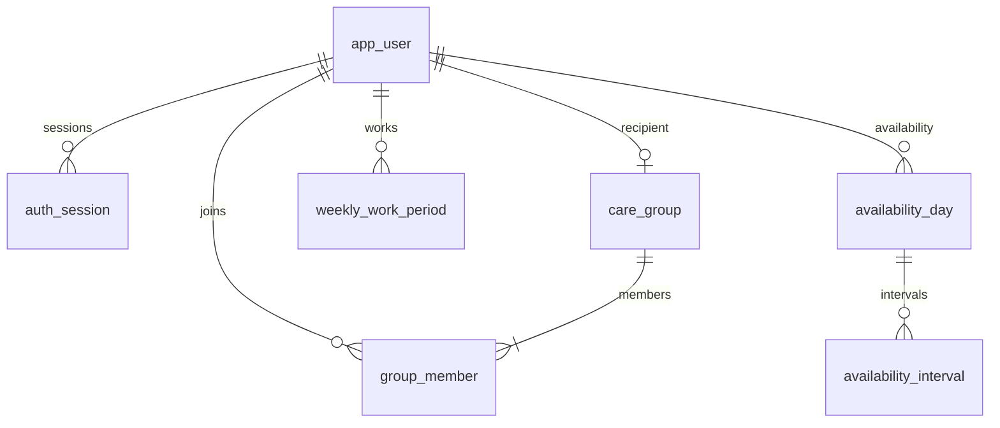
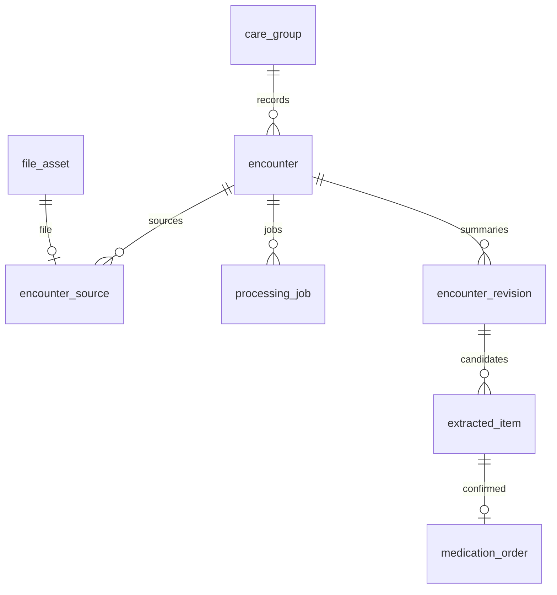
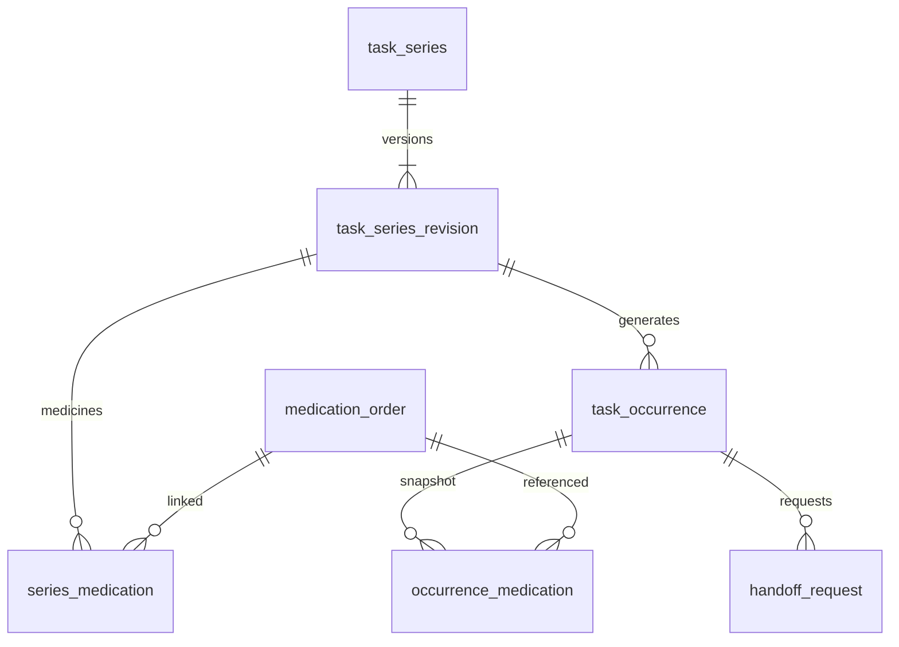

# 가족 돌봄 서비스 — 상세 데이터베이스 설계 v1.2

작성일: 2026-10-02 · 기준 시간대: Asia/Seoul  
기준 문서: 「가족 돌봄 서비스 PRD v0.14」 및 이후 사용자 확정 답변  
대상: PostgreSQL + Spring Boot/JPA + Flyway · 가상 데이터 해커톤 시연  
문서 범위: 논리/물리 모델, 상세 컬럼, 무결성, 일정 알고리즘, 트랜잭션, 초기 데이터, 검증 기준, 초기 DDL

> 이 문서의 사용자 확정 사항은 PRD의 이전 표현보다 우선한다. 그 외 빈칸은 구현 기본값으로 구체화했다. 실제 서버·API를 구현한 결과물이 아니라, 구현에 사용할 DB 설계와 초기 SQL이다. 이번 버전은 PRD v0.14와 문서 업로드·AI 입력 검증 계약을 정렬했다. v1.1 및 이전 PRD·DB 원본은 보존한다.

## 이번 버전 변경사항

- PRD v0.14의 문서 10MB / PDF 10페이지 / 기록당 이미지 10장 MVP 정책 반영.
- file_asset 크기·MIME의 의미 및 페이지 수·개수 검증 책임을 명확화. 28개 테이블·컬럼·DDL 유지.
- OpenAI 공식 입력 기준·확인일·URL, validation 오류 및 비동기 입력 제한 실패 계약 추가.
- v1.1의 인증·배포 변경은 유지하며 아래에 이전 변경 내역을 보존.

- 프론트 Vercel / 백엔드 AWS EC2 분리 배포 반영.
- Cookie Session 대신 Bearer opaque access token 인증으로 변경.
- 교차 출처 CORS 정책 및 API 기본 주소 환경변수 반영.
- 인증과 ACTIVE 공동체 구성원 인가를 구분하고 리소스 접근 검사 명확화.
- 기존 기능·DB 구조는 유지. 토큰 저장 위치는 확정사항과 MVP 추천안을 구분.

## 목차

1. 확정 요구사항과 설계 결정
2. 핵심 구조와 ERD
3. 공통 규약과 무결성 경계
4. 반복 일정·약 묶기·수정·삭제
5. 가능 시간과 배정
6. 인계·완료·동시성
7. 녹음·문서·AI 확인
8. 알림과 재시도
9. 계정·권한·삭제·운영
10. API에 전달할 계약과 조회
11. 시연 데이터와 검증 시나리오
12. 구현 순서 및 제한
13. 상세 테이블 정의서
14. 초기 PostgreSQL DDL
15. 참고 자료 및 검증 범위

## 1. 확정 요구사항과 설계 결정

### 1.1 사용자 확정 사항

| 항목 | 확정 내용 | DB 반영 |
|---|---|---|
| 서비스명 | 가족 돌봄 서비스 | 문서·시연 명칭 통일 |
| 로그인 | 사전 등록 계정 4개: 돌봄 대상 1명, 자녀 3명 | app_user 4행, 기기별 auth_session |
| 공동체 | 대상 계정 등록 시 공동체 생성, 가족은 대상 전화번호로 참여 | 대상당 유일 care_group, 중복 없는 group_member |
| 복약 | 같은 시간에 여러 약을 챙기면 업무 하나 | 시리즈/발생 건 각각 약 목록 연결 |
| 반복 수정 | 이번만 수정 / 동일 내용 모두 수정 | 발생 건 예외와 규칙 버전 분리 |
| 반복 삭제 | 이번만 삭제 / 앞으로 삭제 | 취소 행 보존 + 생성 중단 기준 |
| 복약 방식 | 직접 챙기기·복용 확인을 나누지 않음 | 수행 방식 필드·전체 복약 관리 스위치 없음 |
| 근접 배정 | 첫 시작부터 4시간 이내, 같은 대상·같은 날 | 업무 자체는 합치지 않고 일괄 배정 |
| 알림 | 실제 푸시·알림함, 매일/최초 1회 | outbox, 수신자 알림, 기기 전송 분리 |
| 배포 | 프론트 Vercel / 백엔드 EC2 별도 HTTPS API, 가비아 API 도메인 계획 | PostgreSQL은 백엔드 내부 접근. Origin 분리·CORS 필요 |
| 인증 | 랜덤 opaque access token을 Authorization: Bearer로 전송, JWT 아님 | 기존 auth_session과 token_hash·expires_at·revoked_at 유지 |
| 시연 | 창작 진료 데이터 | 실제 환자용 가입·의료정보 동의 체계는 후속 |

### 1.2 이번 설계에서 정한 구현 기본값

아래는 사용자가 별도로 하나하나 확정한 사항이 아니라, 모순 없이 개발하기 위한 선택이다.

| 결정 | 채택한 기본값과 이유 |
|---|---|
| 일괄 수정 범위 | 같은 series_id의 **현재부터 시작하는 미완료 일정 전체**와 아직 생성하지 않은 이후 발생분. 선택한 날짜 이후로 한정하지 않는다. 완료·취소·이미 시작한 일정은 보존 |
| 수정 안내 | “같은 반복 일정의 아직 시작하지 않은 일정 전체를 수정합니다. 완료·취소·지난 일정은 유지됩니다.” 적용 건수/기간을 저장 전 표시 |
| 예외 덮어쓰기 | 이번만 수정한 미래 일정도 일괄 수정에 포함. 미리보기에서 예외 포함 건수 표시 |
| 의학 정보 변경 | 일정 제목/시각 변경과 약명·용량·횟수 변경을 구분. 약 정보는 새 처방 버전을 확인한 뒤 적용 시작일 기준으로 반영 |
| 시간 기준 | 실제 시각 timestamptz, 반복 날짜 date, 반복 시각 time, 가능 구간은 0~1440분 |
| 반복 단위 | 한 시리즈는 하루 최대 1회. 아침·저녁은 서로 다른 시리즈 |
| 생성 범위 | 오늘부터 14일, 즉 KST [오늘, 오늘+14일) 날짜. 생성 작업은 매일 및 규칙 변경 때 실행 |
| 건수 | 같은 공동체·해당 주 월~일의 취소되지 않은 담당 발생 건. 완료도 포함 |
| 기한 | MVP는 예상 종료 시각 ends_at을 수행 기한으로 사용. 별도 마감이 필요한 기능은 추후 due_at 추가 |
| 경과 | PENDING이고 ends_at <= 현재 시각이면 경과. 별도 업무 상태로 중복 저장하지 않음 |
| 가능 시간 | 미등록은 불가, 활동 기본 07:00~22:00. 사용자가 입력한 날짜만 배정 가능 |
| 변경 동시성 | 일정 변경은 작은 전역 잠금 한 행으로 직렬화. 4계정 시연에서 복잡한 다중 잠금보다 검증 가능성이 높음 |
| 완료 | 실제 수행자와 버튼 처리자를 별도 기록. 돌봄 대상의 본인 체크 허용 |

**‘동일 내용’은 문자열 일치가 아니다.** 제목이 똑같아도 다른 시리즈면 수정하지 않는다. 예를 들어 어머니 아침 약과 아버지 아침 약, 같은 대상의 아침 약과 저녁 약을 함께 바꾸지 않는다. 사용자에게는 선택한 반복 일정 제목과 범위를 보여준다.

## 2. 핵심 구조와 ERD

28개 테이블 중 일정 규칙/약 연결/전송 재시도 등을 분리한 이유는 각각의 수정·삭제·재시도 수명이 다르기 때문이다. 모든 테이블마다 별도 CRUD 화면이나 API를 만드는 것은 아니다. JPA 엔티티도 API 응답으로 직접 노출하지 않는다.

### 2.1 계정·공동체·가능 시간



care_group의 대상 사용자도 group_member에 반드시 RECIPIENT로 존재한다. 사용자 자체에 ‘자녀/어르신’ 전역 역할을 고정하지 않는다. 한 사용자는 어떤 공동체의 대상이면서 다른 공동체의 가족일 수 있다.

### 2.2 진료·출처·확인



독립 문서도 record_type=DOCUMENT인 encounter에 속한다. 진료 일자나 병원명을 억지로 채우지 않는다. 소스가 여러 개여도 요약과 확인 화면은 기록 하나에서 모아 보여준다.

### 2.3 반복·날짜별 수행·인계



규칙 버전의 PK는 (series_id, revision_no)다. 날짜별 업무는 (series_id, anchor_date)로 유일하다. 완료 업무에 연결된 약도 과거 처방 버전을 가리키므로 새 처방이 과거 이력을 바꾸지 않는다.

### 2.4 알림의 책임 분리

| 테이블 | 책임 | 유일성 |
|---|---|---|
| notification_event | 업무와 함께 커밋되는 발생 사건/예약 | event_key |
| notification | 사용자 알림함 | event_id + user_id |
| notification_delivery | 사용자 기기별 푸시 전송 | notification_id + subscription_id |
| push_subscription | 각 기기의 현재 수신 연결 | 활성 endpoint_hash |

이 구조는 푸시가 실패해도 알림함이 남고, 휴대폰 두 대 중 한 대가 실패해도 다른 기기에 반복 전송하지 않게 한다.

## 3. 공통 규약과 무결성 경계

### 3.1 명명·타입·기본 규약

- SQL은 snake_case 단수형 테이블명. id는 서버 생성 UUID. API는 UUID 문자열을 주고받는다.
- PK/필수 필드는 NOT NULL, 선택 정보만 NULL. 빈 문자열로 미상을 표현하지 않는다.
- 실제 순간은 timestamptz. DB 세션은 UTC, 업무 날짜/요일은 Asia/Seoul로 명시적으로 계산한다. timestamptz에 원래 시간대 이름이 보존된다고 가정하지 않는다.
- 가능 구간과 충돌 구간은 [시작, 종료). 13:00~13:30과 13:30~14:00은 겹치지 않는다.
- 상태값은 varchar + CHECK. JPA는 문자열 enum 매핑, ordinal 저장 금지.
- version은 업무 수정마다 증가시키는 낙관적 잠금이다. JPA @Version을 사용하고, 벌크 SQL은 직접 version=version+1을 수행한다.
- updated_at은 DB 트리거로 갱신. 불변 버전 테이블은 수정하지 않고 새 행 추가.
- 실제 파일 바이트·세션 토큰 원문·AI API 키를 업무 DB에 넣지 않는다. 파일의 비공개 object_key만 보관한다.
- JSONB는 AI 후보/근거/변경 이력처럼 가변 구조에만 사용한다. 담당자·상태·날짜·순위 등 검색/제약 대상은 정규 컬럼이다.

### 3.2 공동체 경계

소유 데이터는 group_id를 가진다. 하위 참조는 단순 id FK 대신 `(group_id, target_id)` 복합 FK로 같은 공동체임을 DB에서 보장한다. 예: 다른 공동체의 약을 발생 건에 연결할 수 없다.

사용자 참조는 `(group_id, user_id) -> group_member`로 연결한다. **멤버가 존재한다는 것과 현재 접근 가능하다는 것은 다르다.** 탈퇴 이력을 남기므로 ACTIVE 여부는 서비스에서 반드시 확인한다. 모든 ID 기반 조회는 로그인 사용자와 group_id를 함께 검사한다. UUID 난수성은 접근 통제가 아니다.

### 3.3 DB와 서비스의 책임

| 규칙 | DB 제약 | 서비스 트랜잭션 |
|---|---|---|
| 대상당 공동체 1개 | UNIQUE recipient_user_id | 대상 계정+공동체+멤버 생성 |
| 공동체 대상도 멤버 | 지연 복합 FK, 대상 역할 부분 UNIQUE | 대상 ACTIVE 유지 |
| 담당자 최대 1명 | occurrence의 단일 assignee 컬럼 | 후보·가능 시간 검증 |
| 같은 날짜 중복 생성 금지 | UNIQUE(series_id,anchor_date) | 취소 행을 복원하지 않음 |
| 같은 업무 열린 인계 1개 | OPEN 부분 UNIQUE | 해제·인계·outbox 원자 처리 |
| 다른 공동체 링크 금지 | 복합 FK | ACTIVE·역할·요청 권한 |
| 일정 시간 충돌 금지 | 시간 순서 CHECK | schedule_guard 잠금 후 전 공동체 충돌 검사 |
| 가능 구간 겹침 금지 | 정확히 같은 행 UNIQUE | 정렬·병합·중복 제거 |
| 복약 시리즈 종료일 필수 | 컬럼 자체는 다른 종류 때문에 NULL 가능 | kind=MEDICATION이면 유한 관리기간 검증 |
| 약·업무 유형 일치 | 복합 FK | 약 연결은 MEDICATION에만 허용 |
| 확인 후 한 번 적용 | application_key/generation_key UNIQUE | 확인·약·시리즈 생성 동일 커밋 |
| JSON 속 참조·enum | 최상위 JSON 타입 CHECK | schemaVersion·필드·소스 ID 검증 |
| 문서 크기·형식·페이지·장수 | byte_size 양수만 CHECK, 제품 상한 CHECK 추가 없음 | 실제 파일 검증 후 encounter 행 잠금 아래 이미지 합계 검사·소스 등록; 7.6절 |

다른 행의 상태·업무 의미까지 일반 CHECK로 보장한다고 설명하지 않는다. 부록 DDL만 실행해도 모든 비즈니스 규칙이 구현되는 것은 아니다.

## 4. 반복 일정·약 묶기·수정·삭제

### 4.1 동일 시각의 여러 약

예: 가상 A약 10/3~10/7, 가상 B약 10/3~10/10, 둘 다 08:00.

- ‘아침 약 챙기기’ 시리즈 하나, 규칙 버전에 A/B약 연결.
- 10/3~10/7 발생 건은 A/B 둘 다, 10/8~10/10은 B만 occurrence_medication에 연결.
- 10/11에는 연결할 유효 약이 없으므로 복약 업무를 생성하지 않는다.
- 업무 한 건으로 배정·완료·알림 처리하므로 약 두 개를 배정 두 건으로 세지 않는다.
- 같은 날/시각이라도 복약과 병원 동행은 합치지 않는다. 시간 충돌 또는 별도 업무로 다룬다.

병합 키는 공동체 + 복약 종류 + 반복 패턴 + 시각이며, 후보 약의 기간을 함께 평가한다. 동일 패턴의 미래 복약 시리즈가 이미 있으면 새 시리즈를 무조건 만들지 않고 규칙 버전을 추가해 약 목록을 합친다. 다른 시리즈로 각각 생긴 업무가 동일 시각으로 수정되는 경우에는 병합을 암묵 실행하지 않고 충돌을 반환한다. 이번만 수정된 발생 건의 약 중복도 검토한다.

**복약 횟수와 시각:** 하루 두 번이라는 정보만으로 08:00/20:00을 자동 확정하지 않는다. 확인 카드에서 시각을 받으며 각각 별도 시리즈로 생성한다. 처방 종료일이 없으면 임의 종료일/무기한 처방을 확정하지 않고 후보를 보존한다. 이 설계의 medication_order는 시작·종료일이 확인된 처방만 정규화한다. 미상 처방 자체는 요약·후보에 계속 표시되며, 기록이 사라지지 않는다.

### 4.2 원래 날짜 anchor_date

10/5 반복 업무를 ‘이번만 수정’으로 10/6 10:00으로 옮겨도 anchor_date=10/5를 유지한다. 실제 starts_at은 바뀐다. 생성기는 10/5 행이 이미 있는 것을 보고 다시 만들지 않는다. 10/6 정규 발생 건과는 다른 업무이므로 시간·중복 약 확인 후 사용자에게 두 건이 될 수 있음을 보여준다.

시리즈 한 개에 하루 한 번 원칙 덕분에 anchor_date만으로 발생 정체성이 안정적이다. 향후 한 시리즈에 여러 시각을 지원하려면 고정 slot_id를 추가해야 한다. 이번에는 아침/저녁 시리즈를 분리해 복잡도를 줄인다.

### 4.3 이번만 수정

1. 대상 업무와 version을 확인한다. 완료·취소 건의 일반 일정 수정은 거부한다.
2. 해당 발생 건 snapshot만 변경하고 is_override=true로 설정한다. 규칙 버전이나 다른 날짜는 바꾸지 않는다.
3. 시각/기간이 바뀌면 담당자 가능 시간·다른 일정 충돌을 다시 계산한다.
4. 가능하면 담당자를 유지한다. 불가능하면 해제하고 AVAILABILITY 인계를 열며 임의 자동 재배정하지 않는다.
5. 기존 예약 알림을 무효화하고 새 시각 기준 알림을 만든다. 변경 이력과 version을 같이 남긴다.

기한 경과 PENDING의 단건 수정은 허용하되 과거 완료 사실을 새 일정으로 바꾸지 않는다. 사용자가 미래 시각으로 옮기면 새 수행 계획으로 표시한다.

### 4.4 동일 내용 모두 수정

`scope=SERIES_ALL_PENDING`으로 명세화한다. 저장 시 서버가 cutoff=현재 시각을 한 번 고정한다.

- **범위:** 같은 series_id, status=PENDING, 기존 starts_at>=cutoff. 선택한 업무 날짜 전이라도 아직 시작하지 않았으면 포함한다.
- **보존:** 완료/취소/이미 시작한 업무, 다른 시리즈, 진료·처방 원문.
- 현재 규칙의 새로운 revision_no를 만든다. 기존 버전은 완료/과거 업무가 계속 참조한다.
- 범위 안의 이번만 수정 예외도 새 값으로 맞추고 is_override=false로 만든다. 미리보기에서 이 사실을 표시한다.
- 바뀌지 않은 필드는 유지한다. 날짜별 담당자를 일괄 한 사람으로 바꾸지 않는다. 반복 수정 폼의 담당자 변경은 지원하지 않고 각 일정에서 수행한다.
- 시각 변경 시 새 starts_at이 cutoff 이전이면 저장을 거부하거나 해당 날짜를 명시적으로 제외해야 한다. MVP는 409로 재확인을 요청한다. 몰래 소급 생성하지 않는다.
- 요일/기간에서 빠진 미래 발생 건은 CANCELED/RULE_CHANGED로 만든다. 인계·예약 알림 종료.
- 추가된 날짜는 새로 생성. 기존 USER_ONE/USER_FUTURE 취소는 되살리지 않는다.
- RULE_CHANGED 취소는 이후 규칙에 다시 포함되고 아직 미래면 같은 id의 행을 되살릴 수 있다. 이때 새 규칙/약 snapshot을 적용하고 담당자·완료 필드를 초기화하며 이력을 남긴다. 자동 생성 재시도와 명시적 규칙 수정은 구분한다.
- stop_from_date가 있다면 그 이후는 일괄 수정으로도 재개하지 않는다. 재개 기능은 MVP에 없고 새 일정 생성으로 처리한다.

미리보기 응답에는 seriesId, seriesVersion, cutoff, 변경/취소/추가/예외 덮어쓰기 건수, 조회 범위 밖에 계속 적용될 규칙을 포함한다. 저장 때 변경되었으면 409 후 새 미리보기. 14일 뒤 아직 생성되지 않은 업무도 새 규칙에 영향을 받으므로 “현재 생성된 N건 및 이후 반복분”으로 안내한다.

### 4.5 이번만 삭제 / 앞으로 삭제

| 동작 | 데이터 처리 | 다시 생성되는가 |
|---|---|---|
| 이번만 삭제 | status=CANCELED, USER_ONE, canceled_at 저장 | 해당 anchor_date는 다시 생성하지 않음 |
| 앞으로 삭제 | 선택 anchor_date를 stop_from_date에 저장. 동일 시리즈 그 날짜 이후 PENDING 취소 | 경계 포함 생성 중단 |
| 단발 삭제 | 단발 시리즈의 유일 발생 건 USER_ONE 취소 | 다시 생성하지 않음 |

앞으로 삭제는 **반복상의 날짜(anchor_date)** 기준이며, 이번만 이동한 업무도 원래 반복 위치로 범위 판정한다. UI에 이동 예외를 포함한 취소 목록을 보여준다. 기존 중단일이 더 이르면 유지한다. 완료 건은 보존하며 취소 업무는 건수에서 제외한다. 취소 전 담당자는 이력용으로 행에 남길 수 있지만 조회·충돌·점수에는 포함하지 않는다.

인계 OPEN 종료, 예약 outbox 취소, 대기 delivery 취소까지 같은 업무 트랜잭션에서 처리한다. 이미 외부 푸시 서비스가 받은 알림까지 회수할 수 있다는 의미는 아니다.

### 4.6 생성기

전역 일정 잠금 → 활성 시리즈·현재 규칙 읽기 → 14일 horizon 및 시작/종료/stop_from 조건 → 요일 → 새 시작 시각이 현재 이후인지 확인 → 약 유효기간 → 발생 건 생성 → 배정/미배정 사건 → 알림을 한 단위로 처리한다.

`INSERT ... ON CONFLICT (series_id,anchor_date) DO NOTHING`을 기본으로 한다. 일반 생성기는 기존 행의 시각·예외·취소·완료를 덮어쓰지 않는다. 규칙 반영은 별도 수정 트랜잭션에서 수행한다. 장애 후 horizon 전체를 다시 확인해도 중복되지 않으므로 last_generated 날짜를 진실로 저장할 필요가 없다.

## 5. 가능 시간과 배정

### 5.1 가능 시간의 실제 저장

availability_day는 날짜별 상태, availability_interval은 **배정기가 실제 사용하는 확정 가능 구간**이다.

| 입력 | 구간 생성 |
|---|---|
| 날짜 행 없음 | 미등록, 후보 제외 |
| UNAVAILABLE | 구간 0개 |
| FULL | 활동시간 전체. 그날은 근무 기본값을 무시하는 명시적 선택 |
| PARTIAL, custom_intervals=false | 활동시간 - 요일 근무 구간 |
| PARTIAL, custom_intervals=true | 날짜별로 직접 편집한 최종 가능 구간 |

근무의 날짜별 예외는 그 날짜의 최종 가능 구간을 직접 수정하는 방식이다. 별도의 중복된 ‘예외 근무 테이블’은 만들지 않는다. custom_intervals=true인 날짜는 요일 근무 변경에 덮어쓰이지 않는다.

활동시간/요일 근무 변경은 미래의 자동 계산 날짜를 다시 계산한다. 직접 편집 날짜는 활동 범위를 넘지 않는지 검증하며, 잘려야 하면 미리보기 후 적용한다. 날짜 범위 입력은 범위 하나를 저장하지 않고 각 날짜 행에 펼쳐 저장한다. 하루 수정과 범위 겹침 처리가 쉬워진다.

야간 근무 월요일 22~화요일 06시는 월요일 [1320,1440), 화요일 [0,360)으로 나눈다. 서로 겹치거나 인접한 가능 구간은 저장 전 합친다. 자정 넘는 업무도 날짜별로 나눠 모든 구간이 포함되는지 검사한다.

### 5.2 자동 배정 알고리즘

1. ACTIVE 공동체의 ACTIVE CAREGIVER이자 ACTIVE 계정만 후보로 둔다.
2. 업무 전체 [starts_at,ends_at)이 가능한지 검사한다.
3. 그 사용자의 **모든 공동체**의 미취소 담당 업무와 겹치면 제외한다.
4. 남은 후보 중 priority 최소값을 고른다.
5. 같은 공동체·해당 KST 주의 미취소 배정 건수가 최소인 사람을 고른다.
6. 동률이면 4시간 묶음 전체를 수행할 수 있는 후보 우선, 최종 동률은 group_member.id 정렬로 결정한다.

주간 건수는 별도 누적 컬럼을 두지 않고 occurrence에서 계산한다. 재배정/취소/주간 이동으로 누적값이 틀어지는 문제를 줄인다. 업무의 실제 starts_at이 속한 주로 계산하며 완료 업무도 포함한다. 과거에 한 번 맡았다가 인계한 건을 원 담당자에게 계속 점수로 남기지 않는다.

### 5.3 4시간 묶음은 작업 개수 합치기가 아니다

같은 대상·같은 KST 날짜의 신규 업무를 정렬한다. 첫 시작과 마지막 시작 차이 <=240분, 업무끼리 겹치지 않음, 중간 간격을 포함한 전체 구간에 가능함, 다른 공동체 업무와도 전체 구간이 겹치지 않음을 검사한다.

각 업무의 ‘최상위 순위이면서 최소 건수’ 후보 집합의 교집합이 있어야 묶는다. 없으면 분리한다. 묶음 판정 직전 건수로 함께 결정하고 배정 뒤 실제 업무 수만큼 증가한다. 13·17·21시를 연쇄적으로 하나로 묶지 않는다.

묶음용 별도 테이블은 두지 않는다. 한 번의 배정 계산에서 사용한 이유·업무 ID들은 audit_event의 최소 JSON에 남긴다. 이후 다른 업무가 생겼다고 기존 배정을 자동으로 다시 섞지 않는다. 중간 공백을 영구 예약하는 정책도 아니다. 배정 시점의 연속 수행 가능성만 검사한다.

### 5.4 가능 시간 축소와 탈퇴

미래 담당 업무 중 새 가능 구간에 들어가지 않는 것만 해제한다. 기존 담당자 기록을 남기고 AVAILABILITY/MEMBER_LEFT 사건을 연다. 자동으로 다른 가족에게 떠넘기지 않는다. 순위 변경은 기존 배정에 영향을 주지 않는다. 진행 중/과거 업무는 일괄 가능시간 변경으로 이력을 바꾸지 않고 별도로 안내한다.

## 6. 인계·완료·동시성

### 6.1 상태를 세 축으로 나누기

| 축 | 저장/계산 | 예 |
|---|---|---|
| 수행 상태 | occurrence.status | PENDING, COMPLETED, CANCELED |
| 담당자 | occurrence.assignee_user_id | 사용자 또는 NULL |
| 인계 사건 | handoff_request | OPEN, ACCEPTED, CLOSED, EXPIRED |
| 기한 경과 | PENDING && ends_at<=now | 기한 경과 + 담당자 없음 동시 표현 |
| 확인 필요 | extracted_item | 아직 실행 가능한 업무가 아닌 후보 |

‘기한 경과’ 때문에 담당자 유무나 인계 이력을 잃지 않는다. 홈과 표는 조합 상태를 표시한다. OPEN 인계인데 담당자가 있는 상태는 서비스에서 금지한다.

### 6.2 인계 요청

일정 잠금 획득 → 멤버/업무/version 확인 → PENDING·담당자 존재 확인 → 이전 담당자 저장 → assignee와 assignment_origin NULL → OPEN 요청 생성 → audit + notification_event → 커밋.

최초 배정 실패도 reason=NO_CANDIDATE의 OPEN 사건으로 만든다. 사용자에게는 ‘담당자 없음’으로 표시하며 일반 인계와 같은 반복 알림 기반을 쓴다. 같은 OPEN 사건을 새로고침마다 생성하지 않는다.

### 6.3 내가 맡기

잠금 후 요청 OPEN·업무 PENDING·미경과·담당자 없음·신청자 가능 구간·전 공동체 충돌을 다시 검사한다. 성공 시 assignee를 넣고 origin=HANDOFF, 요청 ACCEPTED/accepted_by/closed_at을 함께 반영한다. 다른 가족의 동시 요청은 최신 상태를 보고 409로 종료된다.

본 설계에서는 이미 기한이 지난 OPEN은 EXPIRED로 닫고 맡기 요청을 거부한다. 업무 자체는 PENDING으로 남아 대리 완료·단건 일정 수정·삭제가 가능하다. 미래로 옮기면 새 미배정 사건을 만들어 다시 맡을 수 있게 한다.

### 6.4 완료·대리 완료·재열기

- 완료: performed_by는 실제 수행자로 기록한 멤버, completed_by는 버튼 처리자, completed_at은 서버 시각. 현재 담당자와 실제 수행자가 다를 수 있다.
- 담당자 없는 일정도 가족/돌봄 대상이 수행 후 완료할 수 있다. 자동 배정 후보 제외와 수행 기록 금지는 다르다.
- 완료가 미래 예약 구간의 충돌을 해제하지는 않는다. 미취소 담당 업무를 점유 구간으로 간주하는 보수적 MVP 규칙이다.
- 완료 시 OPEN 인계와 예약 알림 종료. 동일 완료 재요청은 멱등 처리.
- 재열기: 완료 snapshot을 audit에 남긴 뒤 완료 컬럼을 NULL, 상태 PENDING. 현재 담당자의 ACTIVE/가능시간/충돌을 재검사한다. 부적합이면 해제·새 미배정 사건 생성. 경과 업무는 반복 푸시하지 않는다.
- 점수는 assignee 기준으로 계산한다. performed_by는 실제 수행 이력이며 자동 배정 점수를 뒤늦게 재작성하지 않는다.

### 6.5 MVP 동시성 전략

모든 배정/인계/수락/완료/재열기/취소/반복 수정/발생 생성/가능시간/우선순위/활동시간/멤버십 변경은 트랜잭션 첫 단계에서 다음 행을 잠근다.

```sql
SELECT id FROM schedule_guard WHERE id=1 FOR UPDATE;
```

잠금을 얻은 **후** READ COMMITTED에서 최신 값으로 다시 조회·검증한다. 필요 행에 FOR UPDATE를 추가할 때는 guard를 먼저 잡는다. 동일 트랜잭션에서 DB 쓰기·이력·outbox까지 끝낸다. 이렇게 하면 서로 다른 공동체에서 같은 사람을 동시에 배정하는 경쟁도 직렬화된다.

- 외부 AI·파일 업로드·푸시 HTTP 호출은 이 잠금 안에서 실행하지 않는다.
- 긴 일괄 수정은 처리 건수를 제한하고 재시도 가능한 오류를 반환한다. 시연 계정 규모에서는 비용이 작지만 대규모 서비스용 최종 구조는 아니다.
- 직접 SQL로 잠금 규약을 무시하면 겹침을 막지 못한다. 런타임 변경 경로를 공통 ScheduleMutationService로 모으고 통합 테스트로 검증한다.
- 확장 시 사용자별 잠금 순서 또는 점유 예약 테이블+배타 제약으로 교체할 수 있다. 이번에는 Redis 분산 잠금을 추가하지 않는다.
- version 검사는 잠금과 별개로 오래된 화면의 수정 덮어쓰기를 막는다. `UPDATE ... WHERE id=:id AND version=:expected` 결과 0이면 409.

## 7. 녹음·문서·AI 확인

### 7.1 처리 파이프라인과 상태

문서 입력은 7.6절 서버 검증을 마친 뒤 파일 메타/기록/소스/QUEUED 작업을 생성한다. 음성 입력은 기존 별도 제한을 유지한다. TRANSCRIBE 또는 OCR 워커가 텍스트를 저장하고 소스를 READY로 만든다. 현 입력 버전의 필요한 소스가 모두 준비되면 ANALYZE를 실행한다. 일부 소스가 FAILED면 실패를 알리고 재시도하거나 사용자가 제외하도록 한다. 누락 소스를 조용히 무시한 최종 완료는 표시하지 않는다.

화면 처리 상태는 소스·작업·현재 요약·확인 후보를 합쳐 도출한다. UPLOADING/TRANSCRIBING/ANALYZING/READY/NEEDS_REVIEW/FAILED를 encounter에 중복 저장하지 않는다. 문서 OCR 진행은 해당 소스별로 표시한다.

입력 소스 추가/제거/사용자 전사 수정은 encounter.input_version 증가. 초기 STT/OCR 결과 완성 자체는 같은 입력 버전의 준비 과정이다. ANALYZE는 해당 버전의 입력 snapshot을 사용하고, 반영 때 버전이 바뀌었거나 삭제됐으면 OBSOLETE로 버린다. 같은 (encounter_id,input_version)의 요약은 한 개다.

### 7.2 음성 삭제와 작업 lease

전사 저장과 file_asset.state=DELETE_PENDING을 같은 트랜잭션에서 커밋한다. 삭제 워커가 객체 삭제 성공을 확인한 다음 DELETED, deleted_at, object_key=NULL로 바꾼다. 삭제 실패는 재시도·운영 경고로 추적한다. 요약은 저장된 텍스트로 가능하므로 음성을 기다릴 필요 없다.

업로드 접수 시 음성 expires_at=생성시각+24시간을 기록한다. 전사 실패·고아 업로드도 상한을 넘기면 삭제 대상으로 처리한다. 워커 중단 때문에 삭제 상한을 넘길 수 있으므로 만료 스위퍼와 지연 경고가 필요하다. DB 플래그가 외부 객체의 삭제 자체를 보장하지 않는다.

작업 워커는 FOR UPDATE SKIP LOCKED로 짧게 claim하고 RUNNING+lease_token+lease_until을 커밋한다. 외부 호출은 트랜잭션 밖. 완료 쓰기는 토큰·상태·입력 버전을 검사한다. lease 만료 회수 시 새 토큰을 부여해 늦게 돌아온 이전 워커가 덮어쓰지 못하게 한다. FAILED 재시도는 같은 논리 작업을 QUEUED로 돌리고 시도 횟수 증가. 재시도 때 source가 제거되었는지도 확인한다.

### 7.3 확인 후보와 정규 데이터

extracted_item.payload는 미확정 정보, medication_order/task_series는 적용된 실행 정보다. 필수 시간이 없는 업무를 task_occurrence에 NULL 시각으로 넣지 않는다.

| 후보 | 처리 |
|---|---|
| 명확한 일반 업무 | READY에서 서버가 바로 적용 |
| 신규/변경 약 | NEEDS_REVIEW, 한 카드에서 여러 후보 승인 |
| 날짜/시각/기간 없음 | 필요한 필드만 입력 후 확인 |
| 소스 충돌 | CONFLICT 해소 전 READY/APPLIED 불가 |
| 조건부 계획 | 보류/제외; 확정 예약으로 변환하지 않음 |

일괄 ‘맞아요’는 item ID+version 목록을 받고 같은 기록의 후보임을 확인한 뒤 한 트랜잭션에서 적용한다. 하나라도 충돌/누락/오래된 version이면 목록을 새로 표시하고 부분 적용을 숨기지 않는다. 정상 신규 복약 여러 개는 한 번의 요청으로 확인자·시각을 기록한다.

### 7.4 중복 방지의 범위

- HTTP 재시도: user+operation+client_key UNIQUE, 같은 키 다른 본문 409.
- 작업 재시도: processing_job.dedup_key, 요약 (encounter,input_version) UNIQUE.
- 후보 적용: application_key UNIQUE, 시리즈 generation_key UNIQUE.
- 발생 생성: (series,anchor_date) UNIQUE. 삭제 tombstone 유지.
- **새 파일에 같은 내용이 담긴 경우는 별개 문제다.** SHA-256은 같은 바이트만 찾는다. 같은 진료/약/기간/반복 패턴을 서버가 대조하고 후보의 의미 일치가 불명확하면 확인 대상으로 남긴다. 약명 문자열 하나로 자동 병합하지 않는다.
- 새 분석 버전의 후보를 자동으로 새로운 처방으로 모두 넣지 않는다. 이미 적용된 후보/약/시리즈와 매핑해 동일 의미는 DISMISSED(기적용)로 처리하고 기존 application_key는 재사용 삽입하지 않는다. 변경이면 새 후보와 supersedes_id를 사용한다.

### 7.5 JSON 계약 예시

```json
{
  "schemaVersion": 1,
  "kind": "HOSPITAL",
  "title": "병원 동행",
  "date": "2026-10-06",
  "time": null,
  "durationMinutes": 120,
  "durationSource": "PLANNING_DEFAULT",
  "recurrence": "ONCE"
}
```

```json
[
  {"sourceId": "UUID", "textVersion": 1, "page": 1,
   "startOffset": 12, "endOffset": 40}
]
```

근거 offset은 저장된 extracted_text의 Unicode 코드포인트 기준 [start,end)로 통일한다. Java/JS의 UTF-16 인덱스와 혼동하지 않는다. PDF page는 1부터 시작. 소스 ID·텍스트 버전은 동일 encounter에 속해야 한다. 원문 수정 후 과거 offset이 유효하다고 표시하지 않고 오래된 근거로 표기한다. 의료 문장을 audit나 일반 로그에 복제하지 않는다.

### 7.6 문서 업로드·OpenAI 입력 검증과 저장 책임

PRD v0.14 6절의 **제품 제한**을 적용한다: JPG/JPEG·PNG·WEBP·PDF, 파일당 최대 10MB(10,000,000 bytes), PDF 파일당 10페이지, 한 encounter당 활성 이미지 문서 최대 10장. 오디오에 이 문서 제한을 적용하지 않는다. OpenAI 기술 제한을 제품 최대치로 사용하지 않는다.

| 항목 | 검증·저장 책임 |
|---|---|
| 실제 파일 크기 | 서버가 수신 바이트 수를 확인하고 file_asset.byte_size에 저장. 실제 원본 크기이며 base64·multipart 전송량이 아님 |
| 실제 MIME | signature와 파서/디코더로 확인한 MIME을 file_asset.media_type에 저장. 확장자·클라이언트 Content-Type은 판단 근거의 전부가 아님 |
| PDF 페이지 수 | 업로드 서비스가 실제 PDF를 열어 산정·검증. MVP는 영속 컬럼을 추가하지 않고 검증 결과를 요청 처리 중 사용하며 필요 시 API에 계산값을 반환. 워커는 비공개 원본으로 다시 검사; 클라이언트 값이나 AI의 페이지 추정을 사용하지 않음 |
| 이미지 묶음 수 | encounter_source와 file_asset을 조인해 동일 encounter의 source_type=DOCUMENT, removed_at IS NULL, media_type IN ('image/jpeg','image/png','image/webp')인 소스 개수로 도출. 장수 저장 컬럼/묶음 테이블 추가 없음 |
| 파일 읽기 가능 여부 | 서버 파서/디코더로 손상·빈 파일·암호화 PDF 읽기 실패를 거부. 실패 입력을 OpenAI로 보내지 않음 |
| 원본 | 현재 비공개 object_key 저장 및 공동체 접근 통제를 유지. 외부 호출을 위해 공개 URL로 전환하지 않음 |

이미지 장수는 OCR READY/FAILED 여부와 무관하게 **제거되지 않은 등록 소스**를 센다. PDF 자체와 AUDIO는 장수에서 제외한다. OCR 실패 후 같은 이미지를 재시도하면 기존 소스 ID를 사용하며 새 이미지로 중복 등록하지 않는다. removed_at 기록과 개수 판정은 같은 기록 잠금 규약을 따른다.

동시 업로드는 파일을 비공개 임시 위치에 받고 파일 검증을 먼저 완료한 뒤, 짧은 DB 트랜잭션에서 encounter를 `SELECT ... FOR UPDATE`로 잠그고 최신 ACTIVE 권한·현재 이미지 수 + 신규 이미지 수를 확인해 등록·input_version 증가·QUEUED 작업 생성을 커밋한다. 신규 기록은 동일 트랜잭션에서 생성한다. 외부 AI 호출·파일 전송·PDF parsing 동안 DB 행 잠금을 유지하지 않는다. 모든 문서 추가/제거 경로가 이 규약을 사용해야 9장 상태에서 동시 추가 두 건이 11장으로 통과하지 않는다. 여러 파일 요청은 전부 검증한 후 한 단위로 등록하고, 거부 시 소스/작업을 부분 등록하지 않는다. 검증 전·트랜잭션 실패 임시 파일은 정리한다.

워커는 AVAILABLE 원본과 제거되지 않은 소스를 확인하고 서비스 정책 및 실제 외부 요청 전체 제한을 다시 검증한 후 호출한다. 기존 **소스별 OCR 작업**에서 PDF는 `input_file`, 이미지는 `input_image`에 해당하는 입력으로 처리하며, 각각 확인된 원본 한 파일을 입력으로 보내는 구현 기본값을 유지한다. 여러 파일을 합치는 최적화를 할 경우 요청 합계·직렬화 payload·context/토큰을 별도로 검사하거나 작업을 나눈다. 전체 문서의 OCR 준비 후 기존 ANALYZE 단계에서 합쳐 요약하므로 분할 처리 중 문서 누락을 성공으로 표시하지 않는다. 소스별 결과의 근거 page는 원본 PDF 1-based 페이지를 유지한다.

스키마 변경은 필요 없다. byte_size>0 등의 현재 데이터 무결성만 DB CHECK로 유지하고 MIME allowlist·10MB·10페이지·다른 행의 이미지 장수 상한은 API/서비스 계층에서 검사한다. 계산 가능한 PDF 페이지 수·이미지 장수를 JPA 컬럼처럼 설명하지 않는다. 페이지 수를 영속화하는 최적화는 필요성이 확인된 후 별도 마이그레이션으로 검토한다.

#### OpenAI API 기술 제한 — 공식 근거

| 입력 경로 | 공식 문서에서 확인한 기준 |
|---|---|
| PDF `input_file` | 파일 각각 **50MB 미만**, 한 요청 내 파일 합계 **50MB 제한** |
| PDF 페이지 | 위 가이드에 고정된 5페이지·10페이지 상한은 명시되어 있지 않음. 무제한 처리를 보장하는 뜻은 아니며 모델 context·토큰·처리량 제약을 별도로 확인 |
| PDF 처리 | Vision 가능 모델은 추출 텍스트와 페이지 이미지를 함께 입력받으므로 많은 페이지는 토큰·비용·처리 부담을 늘릴 수 있음 |
| Vision 이미지 형식 | JPEG, PNG, WEBP, 비애니메이션 GIF. GIF는 공식 지원 여부와 별개로 우리 MVP에서 제외 |
| Vision 요청량 | 확인 시점 가이드: 요청 payload 최대 512MB, 이미지 최대 1,500개. PDF `input_file`의 50MB 파일 합계와 별개의 입력 기준 |

지원 모델·context·이미지 해상도/patch·detail별 제약도 적용된다. 업로드가 통과해도 AI 입력이 항상 통과하거나 정확히 인식된다고 보장하지 않는다. Files API의 저장용 업로드 허용량을 모델 입력 허용량으로 대신 사용하지 않는다.

공식 문서 확인일: **2026-10-02 (Asia/Seoul)**. 외부 제한은 변경될 수 있으므로 모델·API를 정할 때와 배포 전에 다시 확인한다.

- OpenAI [File inputs](https://developers.openai.com/api/docs/guides/file-inputs): PDF `input_file` 크기·페이지 처리 기준.
- OpenAI [Images and vision](https://developers.openai.com/api/docs/guides/images-vision): Vision 형식·요청량·모델별 입력 및 detail 기준.

## 8. 알림과 재시도

### 8.1 사건별 키

| 사건 | event_key 구성 예 | 수신 대상 |
|---|---|---|
| 진료 준비 | record:{revisionId}:ready | 현재 ACTIVE 멤버 |
| 신규/변경 배정 | task:{id}:assignment:{version} | 새 담당자, 변경 시 이전 담당자 안내 |
| 인계/미배정 | handoff:{requestId}:open | 현재 ACTIVE 가족 후보 |
| 인계 수락 | handoff:{requestId}:accepted | 요청자·관련 멤버 |
| 30분 전/시작 | task:{id}:v{version}:30m 또는 now | 발송 시 현재 담당자 |
| 경과 | task:{id}:v{version}:overdue | 관련 현재 멤버, 1회 |
| 매일 묶음 | digest:{groupId}:{userId}:{KSTdate} | DAILY 설정 구성원 |

순위 변경·시간 변경 등으로 occurrence.version이 증가하면 유효한 예약 알림도 새 version으로 다시 만들어야 한다. 기존 이벤트를 그대로 남기고 버전 비교만 하면 알림이 사라질 수 있다. 업무 변경 공통 코드에서 이전 예약 취소+미래 예약 재생성을 수행한다. 과거 30분 전 시각은 소급 발송하지 않는다.

### 8.2 최초 1회와 매일

ONCE는 OPEN 사건마다 최초 notification(event,user)을 한 번 생성한다. 같은 요청의 재시도는 같은 사건이다. 수락 후 다시 못하게 된 상황은 새 requestId이므로 새 1회가 맞다.

09:00 KST 스케줄러는 아직 시작하지 않은 PENDING/미배정/OPEN만 모은다. DAILY 수신자별·공동체별 하나의 digest로 보내며 그날 해당 OPEN 최초 알림이 생성된 항목은 제외한다. notification.created_at과 연결 event.handoff_id로 그날 최초 알림 여부를 판단한다. 푸시 권한이 없어도 알림함에 생성됐으면 ‘최초 안내 생성’으로 계산한다.

DAILY→ONCE는 이후 digest에서 제외, ONCE→DAILY는 다음 발송 시점부터 포함한다. 과거 최초 사건을 다시 만들지 않는다. 경과·완료·취소·인계 수락·탈퇴는 발송 직전에도 재검사한다. digest payload에 든 ID 목록은 발송 시 유효 항목만 재조회한다.

### 8.3 기기별 전달

notification_delivery는 알림함 항목 하나를 각 활성 기기에 보내는 작업이다. 고유키로 재시도 중 새 행 중복을 막고 lease로 워커를 회수한다. HTTP 404/410은 해당 구독 비활성화, 일시 실패는 지수 backoff와 최대 시도 횟수 후 FAILED.

SENT는 외부 푸시 서버 수락을 의미하며, 사용자 기기 표시나 읽음을 보장하지 않는다. read_at은 사용자의 알림함 읽기 동작만 기록한다. 네트워크 단절로 전송 성공 응답을 못 받은 경우 중복 푸시가 가능하므로 exactly-once라고 보장하지 않는다. 프론트 notification tag에 event ID를 사용해 중복 표시를 완화한다.

같은 브라우저에서 계정을 바꿀 때 기존 구독 행을 새 user_id로 덮어쓰지 않는다. 기존 행은 enabled=false, 대기 전송 취소, 새 사용자 구독 행 생성. 활성 endpoint_hash만 유일하게 제한하므로 과거 전송의 FK를 유지할 수 있다. 전송 직전 enabled와 소유자를 다시 확인한다.

## 9. 계정·권한·삭제·운영

### 9.1 네 계정의 시연 로그인

| login_key | 표시명 | 공동체 역할 | 초기 우선순위 |
|---|---|---|---|
| demo-parent | 돌봄 대상 | RECIPIENT | NULL |
| demo-child-1 | 자녀 1 | CAREGIVER | 1 |
| demo-child-2 | 자녀 2 | CAREGIVER | 1 |
| demo-child-3 | 자녀 3 | CAREGIVER | 2 |

### 인증·인가 공통 계약 — 확정

MVP는 사전 등록 계정 4개(돌봄 대상 1명, 자녀 3명)를 선택해 로그인한다. 서버가 암호학적으로 안전한 난수 생성기로 256bit 수준의 **opaque access token**을 생성한다. JWT를 사용하지 않으며 토큰 자체에는 사용자·권한 정보를 넣지 않는다. 로그인마다 별도의 auth_session을 생성해 사용자별 복수 기기·세션을 허용한다.

로그인 흐름: 계정 선택 → 랜덤 토큰 생성 → 토큰의 SHA-256 hash만 auth_session.token_hash에 저장 → 로그인 응답 본문에 access token 반환 → 프론트가 인증 API 요청마다 `Authorization: Bearer <access-token>` 헤더 전송. 인증용 Cookie나 Set-Cookie는 사용하지 않는다. 원문 토큰을 DB·로그·URL·분석 도구에 남기지 않는다.

서버 검증 흐름: Authorization의 Bearer 토큰 추출 → SHA-256 계산 → auth_session.token_hash 조회 → 세션 존재, `expires_at > 현재 서버 시각`, `revoked_at IS NULL`, 사용자 계정 ACTIVE 확인 → 로그인 사용자 식별 → 요청 리소스 인가. SHA-256은 전달받은 토큰 문자열의 UTF-8 바이트에 적용하며 발급·조회에서 같은 직렬화를 사용한다. 원문 토큰의 인코딩은 구현 때 고정한다.

| 상황 | HTTP 계약 |
|---|---|
| 토큰 없음·잘못된 토큰·만료·revoked 세션 또는 비활성 계정 | 401 Unauthorized |
| 인증 성공 후 다른 care_group 리소스 접근, LEFT 멤버, 허용되지 않은 수정 | 403 Forbidden |
| 정상 인증·인가 | 해당 API의 정상 응답 |

로그아웃은 **현재 토큰에 해당하는 auth_session.revoked_at을 기록**해 이후 사용을 차단하고 프론트의 원문 토큰도 제거한다. 다른 기기의 세션은 유지한다. expires_at은 절대 만료 시각이며 last_seen_at 갱신으로 자동 연장하지 않는다. 세션 수명 24시간은 기존 추천 기본값/설정값으로 유지한다. refresh token·OAuth·새 인증 테이블은 이번 변경에 추가하지 않는다. 만료 시 프론트는 계정 선택 로그인으로 돌아간다.

여기서 ‘문서 권한 확인’은 매번 휴대폰 본인인증·PASS 인증을 하는 의미가 아니다. **인증(Authentication)**은 Bearer Token으로 현재 사용자를 확인하고, **인가(Authorization)**는 해당 데이터가 속한 care_group의 ACTIVE 멤버인지 확인한다. 같은 공동체의 ACTIVE 구성원은 건강 기록을 열람할 수 있으며, 가족별 세부 문서 열람 권한은 MVP에 추가하지 않는다. 기존 업무별 변경 조건·상태·역할 검사는 그대로 적용한다.

예시 계약 `GET /api/documents/{documentId}`(최종 경로는 API 명세에서 고정): token → user 식별 → 문서와 연결 파일에서 실제 care_group 식별 → `(group_id, user_id)`의 ACTIVE 멤버십 검사 → 허용 시 반환, 권한 없으면 403. 클라이언트가 보낸 groupId를 신뢰하거나 UUID 난수성을 접근 제어로 사용하지 않는다.

동일한 경계 검사를 진료 기록·전사·진료 요약·문서 메타/원본 파일·처방 정보·일정·인계·알림·공동체 정보 및 하위 작업 상태 조회에 적용한다. 알림함 항목은 공동체 ACTIVE 검사에 더해 notification.user_id가 로그인 사용자와 일치해야 한다. 개인 가능 시간·푸시 구독·개인 설정은 기존 사용자 소유권 검사를 유지한다. 목록·수정·삭제·일괄 요청도 각각 서버에서 검사하며, 파일은 비공개 저장소에서 검사 후 제공한다. 파일에 브라우저가 Authorization 헤더를 붙일 수 있도록 인증된 fetch로 내려받아 Blob으로 표시하는 방식을 MVP 구현 추천안으로 둔다. 토큰을 파일 URL 쿼리에 넣지 않는다. 로그아웃·계정 전환 시 기존 건강정보 화면·메모리 데이터와 파일 Blob을 해제한다.

### 브라우저 토큰 보관 — 미정과 추천 구분

Bearer 방식 자체는 확정이지만 브라우저 저장 위치는 최종 확정하지 않았다. localStorage는 **가상 의료 데이터 기반 해커톤 MVP 구현 기본값/추천안**으로 사용할 수 있다. 이는 실서비스 보안 정책의 확정사항이 아니다. XSS 발생 시 JavaScript가 접근 가능한 토큰이 탈취될 수 있으므로 실제 건강정보 운영 전 인증·저장 구조와 XSS 방어를 재검토한다. 이번 문서에서는 새로운 인증 기능을 추가하지 않는다. API 응답·토큰·의료 문서를 PWA 오프라인 캐시에 저장하지 않고 로그인 응답에는 `Cache-Control: no-store`를 적용하는 구현 기준을 둔다.

고정 공개 비밀번호를 문서에 심지 않는다.

대상 계정과 공동체와 대상 멤버는 하나의 트랜잭션에서 생성한다. 상호 FK는 DEFERRABLE INITIALLY DEFERRED이므로 커밋 시 완성된 관계를 검증한다. 가족은 전화번호 조회·이름 확인 후 참여한다. 시연은 자녀 3명의 멤버십을 미리 준비하고, ‘합류 전’ 시나리오는 별도 초기화 옵션으로 둔다.

전화번호는 가상 식별 문자열 또는 관리자가 준비한 시연 번호만 사용하고 문자/전화 발송을 붙이지 않는다. 실서비스의 전화번호 인증 모델로 해석하지 않는다. 시연 선택 로그인에서는 REAL 계정 로그인 경로를 허용하지 않는다.

### 9.2 멤버 탈퇴

group_member 행은 LEFT로 보존한다. 재가입은 기존 행을 ACTIVE로 되돌려 UNIQUE를 유지하고 joined_at을 갱신한다. 여러 번의 가입/탈퇴 내역은 audit에 남긴다. 대상 멤버의 단독 탈퇴는 허용하지 않고 공동체 보존/종료 흐름으로 별도 처리한다.

탈퇴 시 그 공동체의 미래 담당 업무 해제, 새 인계, 미발송 알림 차단. 사용자가 다른 공동체에 참여 중이면 전역 push_subscription 전체를 지우지 않는다. 공동체별 알림 권한만 차단한다. 로그인 세션은 사용자 계정 비활성화/로그아웃 때 종료한다.

### 9.3 삭제의 의미를 구분

| 대상 | 기본 처리 |
|---|---|
| 일정 삭제 | 취소 tombstone + 관련 알림/인계 종료. 진료와 처방 유지 |
| 음성 삭제 | 객체 삭제 확인 후 키 제거, 텍스트는 요약 재시도용 유지 |
| 진료 기록 삭제 | 즉시 접근 차단, 진행 작업 무효화, 연결 미래 일정/약 영향 미리보기 후 정리 |
| 문서 파일 삭제 | 객체 파기 + 소스 제거 + 입력 버전 증가. 재분석/후보 재검토 |
| 사용자 비활성화 | 세션/푸시 차단, 미래 배정 정리. 이력 FK 보존 |

진료 기록 삭제는 deleted_at만 채우는 것으로 끝내지 않는다. 전사/요약/후보/파일 원문 파기 작업을 별도로 실행한다. 공유 약 일정에서는 삭제 기록 유래 약만 빼고 나머지 약이 있으면 업무 유지; 없으면 미완료 업무 취소. 관계 판정은 medication_order.source_item_id와 extracted_item.encounter_id를 사용한다.

MVP에서 기록 삭제를 제공한다면 완료 이력을 ‘일정명·수행자·시각’ 수준으로 보존할지까지 안내하고, 원문을 복사한 약명·설명·snapshot도 파기 대상에 포함한다. 실제 개인정보 삭제 정책을 단순 soft delete로 대체하지 않는다. 참조를 유지한 채 민감 필드를 비식별 placeholder로 치환하고 원문 payload/evidence를 지우는 경로를 마련한다. 이번 시연의 실제 환자 데이터 운영은 범위 밖이다.

### 9.4 운영 기본값

- PostgreSQL 17 이상 호환 문법을 기준으로 작성. 정확한 서버 버전은 배포 때 고정하고 해당 버전에서 Flyway 실행 검증.
- ddl-auto=validate. create/update로 운영 스키마를 바꾸지 않는다.
- V1 스키마는 빈 DB에 한 번 적용. 이미 적용한 V1은 수정하지 않고 다음 V2/V3로 변경.
- DEMO 시드는 개발/시연 프로필에서만 실행하며 재실행해도 계정/공동체 중복이 없어야 한다. 운영 migration에 고정 세션/기기 구독을 넣지 않는다.
- DB/파일 저장소 모두 컨테이너 교체와 분리된 영속 볼륨. 문서는 비공개 경로, 음성은 임시 경로. 업로드 파일의 외부 공개 URL을 DB에 저장하지 않는다.
- DB dump와 파일의 일치된 백업·복원 확인 필요. 백업에는 민감 텍스트·푸시 비밀값이 포함될 수 있으므로 접근을 제한한다.
- API·Nginx·오류 추적 로그에 전사·처방 payload·Authorization 헤더·access token 원문·푸시 endpoint를 출력하지 않는다. 로그인 응답 원문도 로깅하지 않는다.
- 시연 초기화는 공개 API 버튼으로 제공하지 않고 관리자 스크립트에서 DB+임시 파일+대기 작업을 함께 정리한다.

### 9.5 배포·API 호출 경계

프론트는 Vercel, Spring Boot는 AWS EC2, PostgreSQL은 백엔드 인프라에서 관리한다. `https://<frontend>.vercel.app`과 `https://<api-domain>/api/...`는 실제 주소가 아닌 자리표시자다. Nginx는 EC2의 HTTPS API reverse proxy로 사용할 수 있으며 프론트 정적 파일 제공 역할을 요구하지 않는다. 프론트 배포는 Vercel 흐름, 백엔드는 GitHub Actions → EC2 흐름을 유지할 수 있다. Spring Boot 내부 포트·DB를 직접 공개하지 않는 추천 구성을 유지한다.

프론트는 운영 API 기본 주소를 환경변수로 관리한다. Vite를 사용한다면 `VITE_API_BASE_URL=https://<api-domain>`은 구현 예시이며 이름·프레임워크는 미확정이다. 이 예시에서는 base에 `/api`를 넣지 않고 경로 `/api/...`를 붙여 별도 API Origin으로 요청한다. 운영에서 프론트 호스트의 상대 경로만 호출하는 방식이나 프론트 빌드 파일을 EC2로 전송하는 전제는 제거한다. 실제 도메인·Vercel URL·개발 포트는 아직 미정이다.

Service Worker·Web Push 구독은 Vercel 프론트 Origin에 속한다. 구독 등록·설정·알림 조회는 Bearer 인증 API를 사용한다. 푸시 링크는 프론트 화면으로 이동하며 조회 시 인증·ACTIVE 멤버십·알림 소유권을 재검사한다. API Origin 분리로 push_subscription DB 구조를 변경하지 않는다.

### CORS·Cookie·CSRF 구현 경계 — 확정

Vercel 프론트가 별도 EC2 API Origin을 직접 호출하므로 서버에서 CORS를 설정한다. CORS는 브라우저의 교차 출처 접근 정책이며 토큰 인증·공동체 인가를 대신하지 않는다.

| 구분 | 정책 |
|---|---|
| 운영 허용 Origin | 실제 Vercel production origin만 허용하는 것이 기본. 필요하면 명시적으로 등록한 preview origin 추가 |
| 개발 허용 Origin | localhost 프론트 개발 origin을 별도 등록. 포트는 프론트 환경 확정 후 설정 |
| 금지 기본값 | 운영에서 `*` 전체 허용 또는 모든 vercel.app preview 일괄 허용을 기본으로 사용하지 않음 |
| 메서드 | 실제 API에 필요한 메서드만 허용. preflight OPTIONS 처리를 지원 |
| 허용 헤더 | Authorization, Content-Type, Idempotency-Key 및 실제 명세에서 요구하는 추가 헤더만 허용 |
| 인증 Cookie | 자동 전송하지 않음. Cookie 인증용 credentials: include 및 Access-Control-Allow-Credentials 설정을 요구하지 않음 |

Authorization 헤더, JSON Content-Type, Idempotency-Key 등으로 preflight가 발생할 수 있다. OPTIONS는 Bearer 토큰 제출 없이 허용 Origin·요청 메서드·헤더를 검증해 처리하고 실제 API 요청에는 인증·인가를 수행한다. Spring Security 인증 필터보다 CORS/preflight 처리를 먼저 적용하고 허용 Origin의 401/403 응답에도 필요한 CORS 응답 헤더가 붙도록 한다. 여러 Origin을 처리할 때 Vary: Origin을 고려한다. 프론트는 인증 Cookie가 아닌 명시적 Authorization 헤더를 사용하며 fetch의 credentials: omit을 구현 예시로 사용할 수 있다.

Cookie SameSite·Secure/HttpOnly Cookie 전달·Cookie 기반 CSRF 토큰을 현재 인증 흐름의 요구사항으로 두지 않는다. 브라우저가 인증 토큰을 Cookie로 자동 첨부하지 않는 이 Bearer 경로에는 기존 Cookie 세션용 CSRF 설명을 적용하지 않는다. 애플리케이션의 다른 기능에서 Cookie 인증 등을 추가하면 그 경로의 CSRF 위험과 방어를 별도로 검토한다. ‘CSRF가 절대 필요 없다’고 일반화하지 않는다.

## 10. API에 전달할 계약과 조회

### 10.1 반드시 고정할 계약

| 항목 | 계약 |
|---|---|
| 인증 | Authorization: Bearer &lt;access-token&gt;, JWT 아님. 토큰 SHA-256으로 auth_session 조회 |
| 인증 실패 | 없음·잘못됨·만료·revoked: 401 Unauthorized |
| 인가 실패 | 다른 care_group·LEFT·허용되지 않은 수정: 403 Forbidden. NOT_MEMBER는 403 오류 코드로 매핑 |
| 로그아웃 | 현재 auth_session.revoked_at 기록, 이후 사용 차단. 다른 세션은 유지 |
| ID | UUID 문자열, 리소스 실제 group_id로 ACTIVE 멤버십 확인. UUID는 접근 제어 아님 |
| 시각 | ISO-8601 offset 포함. 입력 예 2026-10-05T08:00:00+09:00 |
| 업무 날짜 | YYYY-MM-DD, KST |
| 수정 | OCCURRENCE / SERIES_ALL_PENDING |
| 삭제 | OCCURRENCE / SERIES_FROM_SELECTED |
| 동시성 | expectedVersion 필수, 충돌 409 |
| 재시도 | 생성·확인·인계·완료에 Idempotency-Key |
| 상태 | executionStatus, assignee, openHandoff, isOverdue 분리 |
| 실패 | NOT_MEMBER, VERSION_CONFLICT, TIME_CONFLICT, NOT_AVAILABLE, ALREADY_ASSIGNED, REVIEW_REQUIRED 등 |
| 목록 | 시간 구간 [from,to), cursor는 starts_at+id |
| 미리보기 | 범위·변경 건수·예외 덮어쓰기·seriesVersion 반환 |

클라이언트가 assignee_user_id만 변경하는 범용 PATCH를 직접 호출하게 하지 않는다. 배정·인계·완료·취소는 각각 검증할 명령으로 구현한다.

멱등 요청은 사용자·업무·키에 대한 트랜잭션 advisory lock 또는 일정 명령의 guard를 얻은 다음 저장된 결과를 조회한다. 성공 업무와 결과 레코드를 같은 트랜잭션으로 커밋한다. 실패/롤백은 성공 기록을 남기지 않는다. 동일 키·동일 본문은 저장된 결과 ID/버전 반환, 다른 본문은 409. 만료 청소 후에도 업무 고유키가 장기 중복을 차단한다.

### 10.2 인증 API에 전달할 응답 예시

아래 필드명은 향후 API 명세에서 사용할 구현 예시이며 로그인·로그아웃 경로는 별도 명세에서 고정한다.

```json
{
  "accessToken": "<random-opaque-access-token>",
  "tokenType": "Bearer",
  "expiresAt": "<ISO-8601 absolute expiry>",
  "user": {"id": "<user UUID>"}
}
```

인증 API 요청은 `Authorization: Bearer <access-token>`을 사용한다. accessToken은 로그인 성공 응답에서 전달하고 인증 Cookie를 발급하지 않는다. 응답에 token_hash를 노출하지 않는다. 401은 재로그인, 403은 권한 안내로 구분하며 403을 토큰 만료로 오인해 자동 재로그인시키지 않는다. 401/403 오류 본문 형식은 API 명세에서 통일한다.

### 10.3 대표 조회

```sql
-- 주간 배정 건수: :week_start / :next_week_start는 KST 월요일을 UTC instant로 변환
SELECT assignee_user_id, count(*) AS assigned_count
FROM task_occurrence
WHERE group_id=:group_id
  AND starts_at>=:week_start AND starts_at<:next_week_start
  AND status<>'CANCELED' AND assignee_user_id IS NOT NULL
GROUP BY assignee_user_id;

-- 다른 공동체까지 포함한 충돌: 자신의 수정 대상/묶음 ID는 제외
SELECT id FROM task_occurrence
WHERE assignee_user_id=:user_id AND status<>'CANCELED'
  AND starts_at<:candidate_end AND ends_at>:candidate_start
  AND id<>:editing_occurrence_id;

-- 담당자 없는 미래 업무. 확인 후보는 이 테이블에 들어오지 않는다.
SELECT id,title,starts_at,ends_at,version
FROM task_occurrence
WHERE group_id=:group_id AND status='PENDING'
  AND assignee_user_id IS NULL AND starts_at>=:now
ORDER BY starts_at,id;
```

신규 배정처럼 editing_occurrence_id가 없을 때는 마지막 조건을 제거한다. NULL을 바인딩한 `id<>NULL`은 의도대로 동작하지 않는다. 실제 API에는 위 조회 전에 ACTIVE 멤버십 검사가 필요하다.

홈은 내 PENDING 업무·공동체 미배정 미래 업무·기한 경과 업무를 별도 조회한다. 진료 상세는 encounter+현재 revision+활성 source+후보+연결 업무를 DTO로 합친다. 약 연결은 중간 테이블로 일괄 조회해 N+1을 피한다. 비어 있는 요약과 실패 상태를 404로 혼동하지 않는다.

### 10.4 문서 업로드 validation 계약 — 향후 API 명세 반영

전체 API를 새로 정의하지 않고 기존 오류 코드 규칙(대문자 snake_case)과 인증 401 / 인가 403 계약에 아래 항목을 추가한다. 공통 오류 본문 형식·최종 업로드 경로는 별도 API 명세에서 고정한다.

| 서버 검증 실패 | HTTP / 오류 코드 | 사용자 동작 |
|---|---|---|
| 실제 형식이 지원하지 않는 MIME | 415 Unsupported Media Type / `UNSUPPORTED_MEDIA_TYPE` | JPG/JPEG·PNG·WEBP·PDF로 준비 |
| 파일 바이트 > 10,000,000 | 413 Payload Too Large / `FILE_TOO_LARGE` | 필요한 페이지만 선택하거나 파일 분할 |
| 실제 PDF > 10페이지 | 422 Unprocessable Content / `PDF_PAGE_LIMIT_EXCEEDED` | 10페이지 이하로 선택·분할 |
| 기록의 기존 활성 이미지 + 신규 이미지 > 10장 | 422 / `DOCUMENT_IMAGE_LIMIT_EXCEEDED` | 불필요한 이미지를 제거하거나 별도 기록으로 정리. 동일 기록에 재요청해도 초과 불가 |
| 빈 파일·손상된 PDF/이미지·유효 페이지가 없는 PDF | 422 / `INVALID_DOCUMENT_FILE` | 정상 파일로 다시 업로드 |
| 서버에서 읽을 수 없는 암호화 PDF | 422 / `DOCUMENT_NOT_READABLE` | 암호를 해제한 사본으로 다시 업로드. 비밀번호 수집 기능은 추가하지 않음 |

확장자·브라우저 Content-Type·클라이언트 페이지 수를 신뢰하지 않는다. 서버가 실제 bytes, 파일 signature 및 안전한 PDF 파서/이미지 디코더로 형식·읽기 가능 여부·페이지 수를 확인하고 확인된 MIME을 저장한다. 허용 확장자로 바꾼 실행 파일은 거부한다. 프론트 검사는 안내용이고 최종 판정은 서버다.

검증 순서: Bearer 인증·리소스의 ACTIVE 멤버십 인가 → 제한된 크기의 비공개 임시 업로드 → 실제 바이트·MIME·구조·페이지 검사 → 기록 단위 이미지 개수 검사와 소스 등록 → 검증된 입력만 작업 접수 → 외부 요청 직전 모델/요청 전체 제한 재검사 → OpenAI 호출. 거부된 파일은 AVAILABLE이나 처리 대기 소스로 게시하지 않고 임시 파일을 정리한다. 본 제한은 DOCUMENT에 적용하며 기존 AUDIO 제한을 바꾸지 않는다.

OpenAI가 입력 크기·context·이미지 형식/해상도 등 입력 제한으로 거부하면 `processing_job.status=FAILED`, `error_code=AI_INPUT_LIMIT_EXCEEDED`로 기록한다. OCR 소스는 FAILED로 표시하고, ANALYZE 실패는 준비된 OCR 텍스트를 유지한다. 일반 500이나 성공으로 숨기지 않고 작업 조회에서 단계·오류 코드·파일 조정 안내를 반환한다. 입력을 바꾸지 않는 무한 자동 재시도는 하지 않으며 타임아웃·429 같은 일시 실패와 구분한다. 동기 검증 실패의 4xx와 비동기 작업 조회의 정상 HTTP 응답 안에 담긴 FAILED 상태를 구별한다. 원본·토큰·의료 텍스트나 공급자의 민감한 오류 본문을 일반 로그에 복사하지 않는다.

Nginx·Spring multipart의 파일 제한과 전체 요청 제한을 구분한다. 10MB 파일 하나에 multipart overhead가 붙어 정상 업로드가 거부되지 않게 하고, 여러 파일은 합계/overhead를 고려해 전달하거나 순차 업로드한다. 인프라가 먼저 거부한 413도 프론트에서 처리하며 가능한 범위에서 공통 오류 계약과 허용 Origin의 CORS 헤더를 유지한다. 전체 요청 제한을 OpenAI의 PDF 파일 합계 제한과 동일한 의미로 설명하지 않는다.

## 11. 시연 데이터와 검증 시나리오

### 11.1 시드 데이터 원칙

계정 4개, 공동체 1개, 멤버 4개, 알림 설정 4개를 준비한다. 시연 날짜 기준 앞으로 14일의 FULL/PARTIAL/UNAVAILABLE을 혼합한다. 실행 날짜를 기준으로 생성해 10/9에 모든 샘플이 과거가 되지 않게 한다.

첫째·둘째 동일 1순위, 셋째 2순위. 한 날짜는 첫째 오전/둘째 오후로 나눠 4시간 묶음 실패 사례를 만든다. 샘플 약 이름은 ‘가상 A약/B약’, 실제 처방·개인 전화번호를 가져오지 않는다. 준비된 요약 데이터와 실제 AI 처리 시연 데이터는 구분한다. 푸시 구독은 실제 휴대폰에서 획득하며 seed하지 않는다.

### 11.2 필수 수용 테스트

| 번호 | 입력/경쟁 상황 | 기대 결과 |
|---|---|---|
| 1 | 같은 대상 공동체 두 번 생성 | UNIQUE 거부 |
| 2 | 대상 멤버 없이 공동체 커밋 | 지연 FK 거부 |
| 3 | 다른 공동체 약·소스·담당자 연결 | 복합 FK 거부 |
| 4 | 같은 시리즈/날짜 생성 두 번 | 발생 건 하나 |
| 5 | 이번만 삭제 후 생성기 반복 실행 | 취소 유지 |
| 6 | 앞으로 삭제 후 재분석/생성 | 경계 이후 기존 업무 부활 없음 |
| 7 | 10/5 업무를 10/6으로 이번만 이동 | anchor_date 유지, 원래 업무 재생성 없음 |
| 8 | 동일 내용 모두 수정 | 선택 전 미래 업무도 반영, 완료·취소·과거 유지 |
| 9 | 이전 단건 예외 포함 일괄 수정 | 미리보기 경고 후 예외 초기화 |
| 10 | 약 2개 같은 08시, 종료일 서로 다름 | 업무 하루 1건, 날짜별 유효 약만 연결 |
| 11 | 처방 종료일·시각 누락 | 확인 후보 유지, 임의 자동 배정 없음 |
| 12 | 처방 새 버전 적용 | 완료 업무 약 목록은 이전 버전 |
| 13 | 두 가족 동시 인계 수락 | 한 명만 성공, 나머지 409 |
| 14 | 두 공동체가 같은 사용자 동시 배정 | 겹치는 업무 동시 배정 불가 |
| 15 | 가능 시간 수정과 배정 동시 실행 | guard 후 최신 가능 시간 기준 |
| 16 | 13시/17시, 13시/17:01, 13/17/21 | 경계 포함·초과 제외·연쇄 금지 |
| 17 | 업무 사이에 타 공동체 일정 | 묶음 배정 불가 |
| 18 | 순위만 변경 | 기존 담당자 유지 |
| 19 | 가능 시간 축소 | 충돌 미래 업무만 해제, 인계 사건 생성 |
| 20 | 이미 끝난 미배정 업무 | 경과 표시 유지, 매일 미래 푸시 제외 |
| 21 | 완료/재열기 | 수행자·처리자·전환 이력, 버전 일관 |
| 22 | STT 성공/요약 실패 | 음성 삭제, 텍스트로 요약 재시도 |
| 23 | 오래된 AI 작업이 늦게 반환 | 입력 버전/lease 불일치로 반영 안 됨 |
| 24 | 동일 확인 요청 재전송 | 처방·시리즈 중복 없음 |
| 25 | 인계 최초 알림과 당일 digest | 같은 항목 중복 안내 없음 |
| 26 | 푸시 한 기기 성공, 다른 기기 실패 | 실패 기기만 재시도 |
| 27 | 같은 브라우저에서 계정 전환 | 이전 사용자 대기 푸시 차단, FK 유지 |
| 28 | 탈퇴 후 문서·알림 링크 요청 | ACTIVE 멤버십 거부 |
| 29 | 시간 수정 후 옛 알림 워커 실행 | 구버전 무효화, 새 미래 알림 존재 |
| 30 | 일괄 수정 도중 오류 | 일정/인계/이력/outbox 전체 롤백 |
| 31 | 토큰 없음·오류·만료·revoked | 401, 리소스 데이터 반환 없음 |
| 32 | 같은 그룹 ACTIVE / 타 그룹 / LEFT 멤버의 파일·요약·처방 요청 | 허용 / 403 / 403, UUID 변경으로 우회 불가 |
| 33 | 현재 세션 로그아웃 후 토큰 재사용 및 다른 기기 사용 | 현재 세션 401, 다른 유효 세션 유지 |
| 34 | 허용 Origin OPTIONS와 Bearer 실제 요청·401/403 | preflight 토큰 불필요, 실제 요청 인증·인가, 오류도 CORS 헤더 유지 |
| 35 | 미등록 preview Origin 및 localhost 개발 환경 | 운영에서 미등록 Origin 불허, 개발 origin은 별도 설정 |
| 36 | 다른 사용자 알림/기기 구독 요청 | 같은 그룹이어도 개인 소유권 불일치 거부 |
| 37 | 10,000,000 / 10,000,001 bytes 문서 | 허용 / 413, 거부 파일 외부 호출 없음 |
| 38 | 10 / 11페이지 PDF, 손상/암호화/빈 PDF | 허용 / 422, 읽기 실패 거부 |
| 39 | 기록의 이미지 9장에 1장씩 동시 추가 | 최종 최대 10장, 나머지 422; OCR 실패 소스도 개수 포함 |
| 40 | 이름만 .jpg로 바꾼 비지원 파일 | 실제 형식 검사 후 415; 정상 JPG/PNG/WEBP/PDF 허용 |
| 41 | 정상 업로드 후 OpenAI 입력 제한 거부 | 작업 FAILED / AI_INPUT_LIMIT_EXCEEDED, 단계·조정 안내, 같은 입력 무한 재시도 없음 |
| 42 | 파일 여러 개 중 하나 검증 실패 | 등록/작업 부분 커밋 없음, 비공개 임시 파일 정리 |
| 43 | PDF 여러 개를 하나의 외부 요청으로 묶는 구현 | 개별/합계·context 검사, 필요한 경우 분할. 부분 OCR 결과 누락을 최종 완료로 표시하지 않음 |

## 12. 구현 순서 및 제한

1. V1 스키마·4계정 시드·세션·멤버 권한을 먼저 구현한다.
2. 가능 시간 저장·단발 일정·담당자 수동 변경·완료를 구현한다.
3. 반복 발생·이번만/전체 수정·삭제 tombstone·처방 연결을 구현한다.
4. 전역 일정 잠금을 모든 변경 경로에 적용하고 배정·인계 경쟁을 확인한다.
5. 비동기 전사/OCR/분석·확인 후보를 연결한다. AI 결과가 일정 테이블에 직접 쓰지 않게 한다.
6. outbox·알림함·실제 Web Push를 연결하고 계정 전환/만료 구독을 확인한다.
7. EC2 PostgreSQL에서 Flyway·백업 복원·실제 동시 요청을 검증한다.

새로 생성하는 일정은 과거로 소급 생성하지 않는다. 현재 시각을 지난 오늘의 반복분은 건너뛰되 기존 발생 건은 그대로 유지한다. 새로운 분석의 명확한 날짜가 이미 과거면 확인 후보로 남긴다.

MVP에서는 월간/격주 반복, 약물 상호작용, 처방 의료적 검증, 다중 동행자, 장소 이동 최적화, 기기별 오프라인 의료 캐시, 실제 사용자 동의/초대 정책은 구현 범위 밖이다. DB 구조만으로 의료 정확도나 법적 적합성을 보장하지 않는다.

schedule_guard는 4계정 시연에 맞춘 의도적인 직렬화다. JSONB 근거는 서비스 검증, 겹침은 잠금 규약, 삭제는 외부 파일 워커가 필요하다. 해당 책임을 생략하고 DDL만 배포하면 설계한 동작이 완성되지 않는다.


## 13. 상세 테이블 정의서

컬럼의 NULL 허용과 기본값은 아래 SQL 선언을 기준으로 한다. `PRIMARY KEY`도 NOT NULL이다. 행 단위 외 업무 규칙은 3.3절과 각 흐름을 함께 구현한다.

| 번호 | 테이블 | 책임 |
|---|---|---|
| 1 | `app_user` | 사전 등록 계정 및 개인 활동 시간 |
| 2 | `auth_session` | 사용자별 복수 기기 로그인 |
| 3 | `care_group` | 돌봄 대상 1명에 대한 가족 공동체 |
| 4 | `group_member` | 공동체 참여·우선순위·탈퇴 이력 |
| 5 | `weekly_work_period` | 요일별 고정 근무 구간 |
| 6 | `availability_day` | 날짜별 가능 상태; 행 없음=미등록 |
| 7 | `availability_interval` | 날짜별 확정 가능 구간 |
| 8 | `encounter` | 진료/독립 문서 기록의 공통 묶음 |
| 9 | `file_asset` | 원본 파일 메타데이터·삭제 추적 |
| 10 | `encounter_source` | 음성 전사·OCR 및 출처 단위 |
| 11 | `processing_job` | STT/OCR/요약 비동기 작업과 lease |
| 12 | `encounter_revision` | 진료 요약 버전·근거 목록 |
| 13 | `extracted_item` | 확인 카드·구조화 후보·중복 승인 방지 |
| 14 | `medication_order` | 확인된 처방 정보의 불변 버전 |
| 15 | `task_series` | 반복/단발 업무 정체성과 생성 중단 |
| 16 | `task_series_revision` | 동일 반복 업무의 스케줄·제목 버전 |
| 17 | `series_medication` | 복약 일정 규칙과 여러 약 연결 |
| 18 | `task_occurrence` | 날짜별 업무; 표·완료·인계의 기준 |
| 19 | `occurrence_medication` | 해당 날짜에 실제 적용되는 약 목록 |
| 20 | `handoff_request` | 미배정·인계 사건과 수락 이력 |
| 21 | `audit_event` | 업무 변경 감사 이력; 최소정보만 기록 |
| 22 | `notification_preference` | 사용자별 인계 반복 알림 옵션 |
| 23 | `push_subscription` | 기기별 Web Push 구독 |
| 24 | `notification_event` | 업무 트랜잭션과 함께 기록하는 알림 outbox |
| 25 | `notification` | 사용자별 알림함 |
| 26 | `notification_delivery` | 기기별 전송·재시도; provider 수락과 읽음 구분 |
| 27 | `idempotency_record` | 중복 쓰기 요청 결과 재사용 |
| 28 | `schedule_guard` | MVP 배정·가능시간·일정 변경 직렬화 잠금 |

### 13.1. app_user

사전 등록 계정 및 개인 활동 시간

| 컬럼 | 타입 | NULL | 선언·기본값 | 의미 |
|---|---|---|---|---|
| `id` | `uuid` | 불가 | `PRIMARY KEY DEFAULT gen_random_uuid()` | 서버 생성 식별자 |
| `login_key` | `varchar(50)` | 불가 | `NOT NULL UNIQUE` | demo-parent, demo-child-1~3 |
| `display_name` | `varchar(50)` | 불가 | `NOT NULL` | 화면 표시 이름 |
| `phone_number` | `varchar(20)` | 허용 | `UNIQUE` | 실계정은 E.164 정규화; 시연 번호는 문자 발송 불가 더미 |
| `account_type` | `varchar(10)` | 불가 | `NOT NULL DEFAULT 'DEMO' CHECK (account_type IN ('DEMO','REAL'))` | 계정 유형 |
| `status` | `varchar(12)` | 불가 | `NOT NULL DEFAULT 'ACTIVE' CHECK (status IN ('ACTIVE','DISABLED','DELETED'))` | 접근 상태 |
| `password_hash` | `text` | 허용 | — | 후속 비밀번호 로그인용; MVP NULL |
| `timezone` | `varchar(40)` | 불가 | `NOT NULL DEFAULT 'Asia/Seoul' CHECK (timezone = 'Asia/Seoul')` | MVP 시간대 고정 |
| `active_start_minute` | `smallint` | 불가 | `NOT NULL DEFAULT 420 CHECK (active_start_minute BETWEEN 0 AND 1439)` | 일상 활동 시작: 07:00 |
| `active_end_minute` | `smallint` | 불가 | `NOT NULL DEFAULT 1320 CHECK (active_end_minute BETWEEN 1 AND 1440)` | 일상 활동 종료: 22:00 |
| `created_at` | `timestamptz` | 불가 | `NOT NULL DEFAULT now()` | 생성 시각 |
| `updated_at` | `timestamptz` | 불가 | `NOT NULL DEFAULT now()` | 변경 시각; UPDATE 트리거가 갱신 |
| `version` | `bigint` | 불가 | `NOT NULL DEFAULT 0 CHECK (version >= 0)` | 낙관적 잠금; 업무 변경마다 +1 |

테이블 제약:

```sql
CHECK (active_start_minute < active_end_minute)
```

### 13.2. auth_session

사용자별 복수 기기 로그인. auth_session은 opaque access token을 서버 상태에 연결하는 세션 테이블이다. 전달 방식 변경으로 이름·컬럼·제약조건·인덱스를 바꾸지 않는다.

| 컬럼 | 타입 | NULL | 선언·기본값 | 의미 |
|---|---|---|---|---|
| `id` | `uuid` | 불가 | `PRIMARY KEY DEFAULT gen_random_uuid()` | 서버 생성 식별자 |
| `user_id` | `uuid` | 불가 | `NOT NULL REFERENCES app_user(id)` | 로그인 사용자 |
| `token_hash` | `bytea` | 불가 | `NOT NULL UNIQUE CHECK (octet_length(token_hash)=32)` | Authorization: Bearer로 전달되는 랜덤 256bit 수준 opaque access token 문자열의 SHA-256; 원문 저장 금지 |
| `expires_at` | `timestamptz` | 불가 | `NOT NULL` | 절대 만료 시각 |
| `revoked_at` | `timestamptz` | 허용 | — | 로그아웃·강제 만료 |
| `last_seen_at` | `timestamptz` | 불가 | `NOT NULL DEFAULT now()` | 접속 확인 시각; 매 요청 UPDATE 불필요 |
| `created_at` | `timestamptz` | 불가 | `NOT NULL DEFAULT now()` | 생성 시각 |

테이블 제약:

```sql
CHECK (expires_at > created_at)
```

주요 인덱스:

```sql
CREATE INDEX idx_session_user ON auth_session(user_id, expires_at);
```

### 13.3. care_group

돌봄 대상 1명에 대한 가족 공동체

| 컬럼 | 타입 | NULL | 선언·기본값 | 의미 |
|---|---|---|---|---|
| `id` | `uuid` | 불가 | `PRIMARY KEY DEFAULT gen_random_uuid()` | 서버 생성 식별자 |
| `recipient_user_id` | `uuid` | 불가 | `NOT NULL REFERENCES app_user(id)` | 돌봄 대상; 사용자당 한 공동체 |
| `recipient_role` | `varchar(12)` | 불가 | `NOT NULL DEFAULT 'RECIPIENT' CHECK (recipient_role='RECIPIENT')` | 수혜자 멤버 FK 검증용 고정값 |
| `name` | `varchar(80)` | 불가 | `NOT NULL` | 공동체 이름 |
| `status` | `varchar(10)` | 불가 | `NOT NULL DEFAULT 'ACTIVE' CHECK (status IN ('ACTIVE','ARCHIVED'))` | 보존된 공동체는 신규 업무 금지 |
| `created_at` | `timestamptz` | 불가 | `NOT NULL DEFAULT now()` | 생성 시각 |
| `updated_at` | `timestamptz` | 불가 | `NOT NULL DEFAULT now()` | 변경 시각; UPDATE 트리거가 갱신 |
| `version` | `bigint` | 불가 | `NOT NULL DEFAULT 0 CHECK (version >= 0)` | 낙관적 잠금; 업무 변경마다 +1 |

테이블 제약:

```sql
UNIQUE (recipient_user_id)
```

### 13.4. group_member

공동체 참여·우선순위·탈퇴 이력

| 컬럼 | 타입 | NULL | 선언·기본값 | 의미 |
|---|---|---|---|---|
| `id` | `uuid` | 불가 | `PRIMARY KEY DEFAULT gen_random_uuid()` | 서버 생성 식별자 |
| `group_id` | `uuid` | 불가 | `NOT NULL REFERENCES care_group(id)` | 데이터 소유 공동체 |
| `user_id` | `uuid` | 불가 | `NOT NULL REFERENCES app_user(id)` | 참여 사용자 |
| `role` | `varchar(12)` | 불가 | `NOT NULL CHECK (role IN ('RECIPIENT','CAREGIVER'))` | 동일 UI; 자동 배정 후보는 CAREGIVER |
| `priority` | `smallint` | 허용 | `CHECK (priority BETWEEN 1 AND 99)` | 동순위 허용; 돌봄 대상 NULL |
| `status` | `varchar(10)` | 불가 | `NOT NULL DEFAULT 'ACTIVE' CHECK (status IN ('ACTIVE','LEFT'))` | 탈퇴시 행 유지 |
| `joined_at` | `timestamptz` | 불가 | `NOT NULL DEFAULT now()` | 최근 가입 시각 |
| `left_at` | `timestamptz` | 허용 | — | 탈퇴 시각 |
| `updated_at` | `timestamptz` | 불가 | `NOT NULL DEFAULT now()` | 변경 시각; UPDATE 트리거가 갱신 |
| `version` | `bigint` | 불가 | `NOT NULL DEFAULT 0 CHECK (version >= 0)` | 낙관적 잠금; 업무 변경마다 +1 |

테이블 제약:

```sql
UNIQUE (group_id,user_id),
UNIQUE (group_id,user_id,role),
CHECK ((role='CAREGIVER' AND priority IS NOT NULL) OR (role='RECIPIENT' AND priority IS NULL)),
CHECK ((status='LEFT') = (left_at IS NOT NULL))
```

주요 인덱스:

```sql
CREATE UNIQUE INDEX uq_group_one_recipient ON group_member(group_id) WHERE role='RECIPIENT';
CREATE INDEX idx_member_user ON group_member(user_id,status,group_id);
```

### 13.5. weekly_work_period

요일별 고정 근무 구간

| 컬럼 | 타입 | NULL | 선언·기본값 | 의미 |
|---|---|---|---|---|
| `id` | `uuid` | 불가 | `PRIMARY KEY DEFAULT gen_random_uuid()` | 서버 생성 식별자 |
| `user_id` | `uuid` | 불가 | `NOT NULL REFERENCES app_user(id)` | 근무자 |
| `iso_weekday` | `smallint` | 불가 | `NOT NULL CHECK (iso_weekday BETWEEN 1 AND 7)` | 월=1, 일=7 |
| `start_minute` | `smallint` | 불가 | `NOT NULL CHECK (start_minute BETWEEN 0 AND 1439)` | 당일 00:00부터 분 |
| `end_minute` | `smallint` | 불가 | `NOT NULL CHECK (end_minute BETWEEN 1 AND 1440)` | 종료 제외; 1440=다음 자정 |
| `created_at` | `timestamptz` | 불가 | `NOT NULL DEFAULT now()` | 생성 시각 |
| `updated_at` | `timestamptz` | 불가 | `NOT NULL DEFAULT now()` | 변경 시각; UPDATE 트리거가 갱신 |

테이블 제약:

```sql
CHECK (start_minute < end_minute),
UNIQUE (user_id,iso_weekday,start_minute,end_minute)
```

### 13.6. availability_day

날짜별 가능 상태; 행 없음=미등록

| 컬럼 | 타입 | NULL | 선언·기본값 | 의미 |
|---|---|---|---|---|
| `id` | `uuid` | 불가 | `PRIMARY KEY DEFAULT gen_random_uuid()` | 서버 생성 식별자 |
| `user_id` | `uuid` | 불가 | `NOT NULL REFERENCES app_user(id)` | 모든 공동체에서 공유하는 개인 캘린더 |
| `local_date` | `date` | 불가 | `NOT NULL` | KST 기준 날짜 |
| `mode` | `varchar(12)` | 불가 | `NOT NULL CHECK (mode IN ('FULL','PARTIAL','UNAVAILABLE'))` | 풀타임/파트타임/불가 |
| `custom_intervals` | `boolean` | 불가 | `NOT NULL DEFAULT false` | true면 사용자가 직접 지정한 가능 구간을 유지 |
| `created_at` | `timestamptz` | 불가 | `NOT NULL DEFAULT now()` | 생성 시각 |
| `updated_at` | `timestamptz` | 불가 | `NOT NULL DEFAULT now()` | 변경 시각; UPDATE 트리거가 갱신 |
| `version` | `bigint` | 불가 | `NOT NULL DEFAULT 0 CHECK (version >= 0)` | 낙관적 잠금; 업무 변경마다 +1 |

테이블 제약:

```sql
UNIQUE (user_id,local_date),
UNIQUE (id,user_id),
CHECK (NOT custom_intervals OR mode <> 'UNAVAILABLE')
```

주요 인덱스:

```sql
CREATE INDEX idx_availability_date ON availability_day(local_date,user_id);
```

### 13.7. availability_interval

날짜별 확정 가능 구간

| 컬럼 | 타입 | NULL | 선언·기본값 | 의미 |
|---|---|---|---|---|
| `id` | `uuid` | 불가 | `PRIMARY KEY DEFAULT gen_random_uuid()` | 서버 생성 식별자 |
| `day_id` | `uuid` | 불가 | `NOT NULL REFERENCES availability_day(id) ON DELETE CASCADE` | 소유 날짜 |
| `start_minute` | `smallint` | 불가 | `NOT NULL CHECK (start_minute BETWEEN 0 AND 1439)` | 가능 구간 시작 |
| `end_minute` | `smallint` | 불가 | `NOT NULL CHECK (end_minute BETWEEN 1 AND 1440)` | 가능 구간 종료, 제외 |

테이블 제약:

```sql
CHECK (start_minute < end_minute),
UNIQUE (day_id,start_minute,end_minute)
```

### 13.8. encounter

진료/독립 문서 기록의 공통 묶음

| 컬럼 | 타입 | NULL | 선언·기본값 | 의미 |
|---|---|---|---|---|
| `id` | `uuid` | 불가 | `PRIMARY KEY DEFAULT gen_random_uuid()` | 서버 생성 식별자 |
| `group_id` | `uuid` | 불가 | `NOT NULL REFERENCES care_group(id)` | 데이터 소유 공동체 |
| `created_by` | `uuid` | 불가 | `NOT NULL` | 기록 생성자 |
| `record_type` | `varchar(12)` | 불가 | `NOT NULL CHECK (record_type IN ('VISIT','DOCUMENT'))` | 독립 문서도 DOCUMENT 기록에 속함 |
| `occurred_on` | `date` | 허용 | — | 실제 진료일; 미상은 NULL |
| `hospital_name` | `varchar(150)` | 허용 | — | 확인된 기관명 |
| `title` | `varchar(150)` | 불가 | `NOT NULL` | 기록 제목 |
| `input_version` | `integer` | 불가 | `NOT NULL DEFAULT 1 CHECK (input_version>0)` | 소스 추가/제거/전사 수정 시 증가 |
| `deleted_at` | `timestamptz` | 허용 | — | 기록 삭제/파기 접수 |
| `created_at` | `timestamptz` | 불가 | `NOT NULL DEFAULT now()` | 생성 시각 |
| `updated_at` | `timestamptz` | 불가 | `NOT NULL DEFAULT now()` | 변경 시각; UPDATE 트리거가 갱신 |
| `version` | `bigint` | 불가 | `NOT NULL DEFAULT 0 CHECK (version >= 0)` | 낙관적 잠금; 업무 변경마다 +1 |

테이블 제약:

```sql
UNIQUE (group_id,id),
FOREIGN KEY (group_id, created_by) REFERENCES group_member(group_id, user_id)
```

주요 인덱스:

```sql
CREATE INDEX idx_encounter_timeline ON encounter(group_id,occurred_on DESC,created_at DESC) WHERE deleted_at IS NULL;
```

### 13.9. file_asset

원본 파일 메타데이터·삭제 추적

| 컬럼 | 타입 | NULL | 선언·기본값 | 의미 |
|---|---|---|---|---|
| `id` | `uuid` | 불가 | `PRIMARY KEY DEFAULT gen_random_uuid()` | 서버 생성 식별자 |
| `group_id` | `uuid` | 불가 | `NOT NULL REFERENCES care_group(id)` | 데이터 소유 공동체 |
| `uploaded_by` | `uuid` | 불가 | `NOT NULL` | 업로드 사용자 |
| `purpose` | `varchar(12)` | 불가 | `NOT NULL CHECK (purpose IN ('AUDIO','DOCUMENT'))` | 음성 임시/문서 원본 |
| `object_key` | `text` | 허용 | `UNIQUE` | 비공개 저장소 키; 파기 완료 후 NULL |
| `original_name` | `varchar(255)` | 허용 | — | 표시 파일명; 파기 시 제거 가능 |
| `media_type` | `varchar(120)` | 불가 | `NOT NULL` | signature·파서/디코더로 실제 확인한 MIME; DOCUMENT allowlist는 서비스 검증 |
| `byte_size` | `bigint` | 불가 | `NOT NULL CHECK (byte_size>0)` | 실제 원본 바이트 수; DOCUMENT 10MB 상한은 서비스 검증, 오디오 제한 별도 |
| `sha256` | `bytea` | 불가 | `NOT NULL CHECK (octet_length(sha256)=32)` | 바이트 중복 탐지; 공동체 범위 조회 |
| `state` | `varchar(20)` | 불가 | `NOT NULL DEFAULT 'UPLOADING' CHECK (state IN ('UPLOADING','AVAILABLE','DELETE_PENDING','DELETED','FAILED'))` | 객체 상태 |
| `expires_at` | `timestamptz` | 허용 | — | 음성은 업로드 시 +24h 상한, 성공 시 즉시 삭제 예약 |
| `deleted_at` | `timestamptz` | 허용 | — | 실제 객체 삭제 확인 시각 |
| `delete_attempts` | `integer` | 불가 | `NOT NULL DEFAULT 0 CHECK (delete_attempts>=0)` | 삭제 재시도 |
| `created_at` | `timestamptz` | 불가 | `NOT NULL DEFAULT now()` | 생성 시각 |
| `updated_at` | `timestamptz` | 불가 | `NOT NULL DEFAULT now()` | 변경 시각; UPDATE 트리거가 갱신 |

테이블 제약:

```sql
UNIQUE (group_id,id),
FOREIGN KEY (group_id, uploaded_by) REFERENCES group_member(group_id, user_id),
CHECK (purpose<>'AUDIO' OR expires_at IS NOT NULL),
CHECK ((state='DELETED' AND object_key IS NULL AND deleted_at IS NOT NULL) OR (state<>'DELETED' AND object_key IS NOT NULL AND deleted_at IS NULL))
```

주요 인덱스:

```sql
CREATE INDEX idx_asset_expiry ON file_asset(expires_at) WHERE state <> 'DELETED';
CREATE INDEX idx_asset_hash ON file_asset(group_id,sha256);
```

제품 제한과 PDF 페이지 수·이미지 장수는 7.6절 책임 분리를 적용한다. file_asset에 페이지 수/이미지 묶음 수 컬럼을 새로 추가하지 않는다.

### 13.10. encounter_source

음성 전사·OCR 및 출처 단위

| 컬럼 | 타입 | NULL | 선언·기본값 | 의미 |
|---|---|---|---|---|
| `id` | `uuid` | 불가 | `PRIMARY KEY DEFAULT gen_random_uuid()` | 서버 생성 식별자 |
| `group_id` | `uuid` | 불가 | `NOT NULL REFERENCES care_group(id)` | 데이터 소유 공동체 |
| `encounter_id` | `uuid` | 불가 | `NOT NULL` | 소유 기록 |
| `asset_id` | `uuid` | 불가 | `NOT NULL` | 원본 파일 |
| `source_type` | `varchar(10)` | 불가 | `NOT NULL CHECK (source_type IN ('AUDIO','DOCUMENT'))` | 원본 유형 |
| `extracted_text` | `text` | 허용 | — | 전사/OCR 원문 |
| `text_version` | `integer` | 불가 | `NOT NULL DEFAULT 0 CHECK (text_version>=0)` | 추출/수정 버전 |
| `status` | `varchar(12)` | 불가 | `NOT NULL DEFAULT 'PENDING' CHECK (status IN ('PENDING','READY','FAILED'))` | 소스 변환 상태 |
| `removed_at` | `timestamptz` | 허용 | — | 기록에서 제거; 재분석 제외 |
| `created_at` | `timestamptz` | 불가 | `NOT NULL DEFAULT now()` | 생성 시각 |
| `updated_at` | `timestamptz` | 불가 | `NOT NULL DEFAULT now()` | 변경 시각; UPDATE 트리거가 갱신 |

테이블 제약:

```sql
UNIQUE (group_id,id),
UNIQUE (group_id,encounter_id,id),
UNIQUE (asset_id),
FOREIGN KEY (group_id, encounter_id) REFERENCES encounter(group_id, id),
FOREIGN KEY (group_id, asset_id) REFERENCES file_asset(group_id, id)
```

주요 인덱스:

```sql
CREATE INDEX idx_source_encounter ON encounter_source(encounter_id);
```

### 13.11. processing_job

STT/OCR/요약 비동기 작업과 lease

| 컬럼 | 타입 | NULL | 선언·기본값 | 의미 |
|---|---|---|---|---|
| `id` | `uuid` | 불가 | `PRIMARY KEY DEFAULT gen_random_uuid()` | 서버 생성 식별자 |
| `group_id` | `uuid` | 불가 | `NOT NULL REFERENCES care_group(id)` | 데이터 소유 공동체 |
| `encounter_id` | `uuid` | 불가 | `NOT NULL` | 대상 기록 |
| `source_id` | `uuid` | 허용 | — | TRANSCRIBE/OCR 작업의 소스 |
| `job_type` | `varchar(12)` | 불가 | `NOT NULL CHECK (job_type IN ('TRANSCRIBE','OCR','ANALYZE'))` | 작업 유형 |
| `input_version` | `integer` | 불가 | `NOT NULL CHECK (input_version>0)` | 접수 시 기록 입력 버전 |
| `dedup_key` | `varchar(160)` | 불가 | `NOT NULL UNIQUE` | 소스·유형 또는 기록·입력버전으로 생성 |
| `status` | `varchar(12)` | 불가 | `NOT NULL DEFAULT 'QUEUED' CHECK (status IN ('QUEUED','RUNNING','SUCCEEDED','FAILED','OBSOLETE'))` | 오래된 결과 OBSOLETE |
| `attempt_count` | `integer` | 불가 | `NOT NULL DEFAULT 0 CHECK (attempt_count>=0)` | 재시도 횟수 |
| `available_at` | `timestamptz` | 불가 | `NOT NULL DEFAULT now()` | 다음 처리 가능 시각 |
| `lease_token` | `uuid` | 허용 | — | worker 소유권; 재회수마다 새 값 |
| `lease_until` | `timestamptz` | 허용 | — | 잠금 만료 |
| `provider` | `varchar(60)` | 허용 | — | 호출 공급자 |
| `model` | `varchar(100)` | 허용 | — | 모델 식별자 |
| `prompt_version` | `varchar(40)` | 허용 | — | 프롬프트 버전 |
| `error_code` | `varchar(60)` | 허용 | — | 원문 개인정보 없는 코드; 입력 제한 실패는 AI_INPUT_LIMIT_EXCEEDED |
| `created_at` | `timestamptz` | 불가 | `NOT NULL DEFAULT now()` | 생성 시각 |
| `updated_at` | `timestamptz` | 불가 | `NOT NULL DEFAULT now()` | 변경 시각; UPDATE 트리거가 갱신 |

테이블 제약:

```sql
UNIQUE (group_id,id),
UNIQUE (group_id,encounter_id,id),
FOREIGN KEY (group_id, encounter_id) REFERENCES encounter(group_id, id),
FOREIGN KEY (group_id,encounter_id,source_id) REFERENCES encounter_source(group_id,encounter_id,id),
CHECK ((job_type='ANALYZE' AND source_id IS NULL) OR (job_type<>'ANALYZE' AND source_id IS NOT NULL)),
CHECK ((status='RUNNING' AND lease_token IS NOT NULL AND lease_until IS NOT NULL) OR (status<>'RUNNING' AND lease_token IS NULL AND lease_until IS NULL))
```

주요 인덱스:

```sql
CREATE INDEX idx_job_queue ON processing_job(status,available_at,lease_until);
```

### 13.12. encounter_revision

진료 요약 버전·근거 목록

| 컬럼 | 타입 | NULL | 선언·기본값 | 의미 |
|---|---|---|---|---|
| `id` | `uuid` | 불가 | `PRIMARY KEY DEFAULT gen_random_uuid()` | 서버 생성 식별자 |
| `group_id` | `uuid` | 불가 | `NOT NULL REFERENCES care_group(id)` | 데이터 소유 공동체 |
| `encounter_id` | `uuid` | 불가 | `NOT NULL` | 소유 기록 |
| `input_version` | `integer` | 불가 | `NOT NULL CHECK (input_version>0)` | 분석한 소스 버전 |
| `job_id` | `uuid` | 불가 | `NOT NULL UNIQUE` | 성공 분석 작업 |
| `summary` | `text` | 불가 | `NOT NULL` | 쉬운 진료 요약 |
| `details` | `jsonb` | 불가 | `NOT NULL DEFAULT '{}'::jsonb CHECK (jsonb_typeof(details)='object')` | 증상·검사·주의사항·키워드; schemaVersion 포함 |
| `evidence` | `jsonb` | 불가 | `NOT NULL DEFAULT '[]'::jsonb CHECK (jsonb_typeof(evidence)='array')` | sourceId, textVersion, start/end offset 또는 page; 동일 기록 소스 검증 |
| `is_current` | `boolean` | 불가 | `NOT NULL DEFAULT false` | 화면에 표시하는 최신 적용본 |
| `created_at` | `timestamptz` | 불가 | `NOT NULL DEFAULT now()` | 생성 시각 |

테이블 제약:

```sql
UNIQUE (group_id,id),
UNIQUE (group_id,encounter_id,id),
UNIQUE (encounter_id,input_version),
FOREIGN KEY (group_id, encounter_id) REFERENCES encounter(group_id, id),
FOREIGN KEY (group_id,encounter_id,job_id) REFERENCES processing_job(group_id,encounter_id,id)
```

주요 인덱스:

```sql
CREATE UNIQUE INDEX uq_current_summary ON encounter_revision(encounter_id) WHERE is_current;
```

### 13.13. extracted_item

확인 카드·구조화 후보·중복 승인 방지

| 컬럼 | 타입 | NULL | 선언·기본값 | 의미 |
|---|---|---|---|---|
| `id` | `uuid` | 불가 | `PRIMARY KEY DEFAULT gen_random_uuid()` | 서버 생성 식별자 |
| `group_id` | `uuid` | 불가 | `NOT NULL REFERENCES care_group(id)` | 데이터 소유 공동체 |
| `encounter_id` | `uuid` | 불가 | `NOT NULL` | 원본 기록 |
| `revision_id` | `uuid` | 불가 | `NOT NULL` | 추출 요약 버전 |
| `item_key` | `varchar(100)` | 불가 | `NOT NULL` | 같은 분석 결과 내 안정적인 서버 부여 키 |
| `item_type` | `varchar(12)` | 불가 | `NOT NULL CHECK (item_type IN ('TASK','MEDICATION'))` | 일정 후보 또는 처방 후보 |
| `payload` | `jsonb` | 불가 | `NOT NULL CHECK (jsonb_typeof(payload)='object')` | 확정 전 필수값 누락을 허용하는 후보 JSON |
| `evidence` | `jsonb` | 불가 | `NOT NULL DEFAULT '[]'::jsonb CHECK (jsonb_typeof(evidence)='array')` | 원문 근거 참조 |
| `review_state` | `varchar(16)` | 불가 | `NOT NULL CHECK (review_state IN ('NEEDS_REVIEW','READY','APPLIED','DISMISSED','SUPERSEDED'))` | 확인·적용·제외 상태 |
| `review_reasons` | `text[]` | 불가 | `NOT NULL DEFAULT '{}'` | MISSING_TIME, MED_CHANGE, CONFLICT 등 |
| `reviewed_by` | `uuid` | 허용 | — | 한 화면 일괄 확인 처리자 |
| `reviewed_at` | `timestamptz` | 허용 | — | 확인 시각 |
| `application_key` | `varchar(160)` | 허용 | `UNIQUE` | 같은 의미 후보 재적용 차단; 서버 중복 검토 후 부여 |
| `applied_at` | `timestamptz` | 허용 | — | 정규 데이터 반영 시각 |
| `created_at` | `timestamptz` | 불가 | `NOT NULL DEFAULT now()` | 생성 시각 |
| `updated_at` | `timestamptz` | 불가 | `NOT NULL DEFAULT now()` | 변경 시각; UPDATE 트리거가 갱신 |
| `version` | `bigint` | 불가 | `NOT NULL DEFAULT 0 CHECK (version >= 0)` | 낙관적 잠금; 업무 변경마다 +1 |

테이블 제약:

```sql
UNIQUE (group_id,id),
UNIQUE (revision_id,item_key),
FOREIGN KEY (group_id, encounter_id) REFERENCES encounter(group_id, id),
FOREIGN KEY (group_id,encounter_id,revision_id) REFERENCES encounter_revision(group_id,encounter_id,id),
FOREIGN KEY (group_id, reviewed_by) REFERENCES group_member(group_id, user_id),
CHECK ((reviewed_by IS NULL)=(reviewed_at IS NULL)),
CHECK (review_state<>'APPLIED' OR (application_key IS NOT NULL AND applied_at IS NOT NULL))
```

주요 인덱스:

```sql
CREATE INDEX idx_review_pending ON extracted_item(group_id,review_state,created_at);
```

### 13.14. medication_order

확인된 처방 정보의 불변 버전

| 컬럼 | 타입 | NULL | 선언·기본값 | 의미 |
|---|---|---|---|---|
| `id` | `uuid` | 불가 | `PRIMARY KEY DEFAULT gen_random_uuid()` | 서버 생성 식별자 |
| `group_id` | `uuid` | 불가 | `NOT NULL REFERENCES care_group(id)` | 데이터 소유 공동체 |
| `source_item_id` | `uuid` | 불가 | `NOT NULL UNIQUE` | 확인된 약 후보 |
| `supersedes_id` | `uuid` | 허용 | — | 변경 전 처방; 과거 행을 덮어쓰지 않음 |
| `name` | `varchar(150)` | 불가 | `NOT NULL` | 확인된 약명 |
| `dose_text` | `varchar(100)` | 불가 | `NOT NULL` | 1정/5mL 등; 숫자로 임의 환산 금지 |
| `frequency_text` | `varchar(150)` | 불가 | `NOT NULL` | 하루 2회, 식후 등 원문 의미 |
| `starts_on` | `date` | 불가 | `NOT NULL` | 확인된 복약 시작일 |
| `ends_on` | `date` | 불가 | `NOT NULL` | 확인된 종료일; 없으면 후보에 보류 |
| `instructions` | `text` | 허용 | — | 원문 추가 안내 |
| `confirmed_by` | `uuid` | 불가 | `NOT NULL` | 확인 사용자 |
| `confirmed_at` | `timestamptz` | 불가 | `NOT NULL DEFAULT now()` | 확인 시각 |
| `created_at` | `timestamptz` | 불가 | `NOT NULL DEFAULT now()` | 생성 시각 |

테이블 제약:

```sql
UNIQUE (group_id,id),
FOREIGN KEY (group_id, source_item_id) REFERENCES extracted_item(group_id, id),
FOREIGN KEY (group_id, supersedes_id) REFERENCES medication_order(group_id, id),
FOREIGN KEY (group_id, confirmed_by) REFERENCES group_member(group_id, user_id),
CHECK (ends_on>=starts_on),
CHECK (supersedes_id IS NULL OR supersedes_id<>id)
```

### 13.15. task_series

반복/단발 업무 정체성과 생성 중단

| 컬럼 | 타입 | NULL | 선언·기본값 | 의미 |
|---|---|---|---|---|
| `id` | `uuid` | 불가 | `PRIMARY KEY DEFAULT gen_random_uuid()` | 서버 생성 식별자 |
| `group_id` | `uuid` | 불가 | `NOT NULL REFERENCES care_group(id)` | 데이터 소유 공동체 |
| `kind` | `varchar(16)` | 불가 | `NOT NULL CHECK (kind IN ('MEDICATION','HOSPITAL','EXAM','PICKUP','OTHER'))` | 복약 수행 방식 구분 없음 |
| `created_by` | `uuid` | 불가 | `NOT NULL` | 최초 생성자 또는 AI 적용 요청자 |
| `source_item_id` | `uuid` | 허용 | `UNIQUE` | 일반 TASK 후보; 수동·복약 묶음이면 NULL 가능 |
| `generation_key` | `varchar(180)` | 불가 | `NOT NULL` | 입력 재적용용 서버 멱등키; 제목 아님 |
| `current_revision_no` | `integer` | 불가 | `NOT NULL DEFAULT 1 CHECK (current_revision_no>0)` | 현재 규칙 버전; deferred FK |
| `stop_from_date` | `date` | 허용 | — | 앞으로 삭제의 기준 anchor_date 포함; 미래 생성 차단 |
| `created_at` | `timestamptz` | 불가 | `NOT NULL DEFAULT now()` | 생성 시각 |
| `updated_at` | `timestamptz` | 불가 | `NOT NULL DEFAULT now()` | 변경 시각; UPDATE 트리거가 갱신 |
| `version` | `bigint` | 불가 | `NOT NULL DEFAULT 0 CHECK (version >= 0)` | 낙관적 잠금; 업무 변경마다 +1 |

테이블 제약:

```sql
UNIQUE (group_id,id),
UNIQUE (group_id,generation_key),
FOREIGN KEY (group_id, created_by) REFERENCES group_member(group_id, user_id),
FOREIGN KEY (group_id, source_item_id) REFERENCES extracted_item(group_id, id)
```

### 13.16. task_series_revision

동일 반복 업무의 스케줄·제목 버전

| 컬럼 | 타입 | NULL | 선언·기본값 | 의미 |
|---|---|---|---|---|
| `series_id` | `uuid` | 불가 | `NOT NULL` | 반복 업무 |
| `revision_no` | `integer` | 불가 | `NOT NULL CHECK (revision_no>0)` | 업무 내 증가 번호 |
| `group_id` | `uuid` | 불가 | `NOT NULL REFERENCES care_group(id)` | 데이터 소유 공동체 |
| `title` | `varchar(150)` | 불가 | `NOT NULL` | 아침 약 챙기기 등 |
| `description` | `text` | 허용 | — | 할 일 설명 |
| `recurrence` | `varchar(10)` | 불가 | `NOT NULL CHECK (recurrence IN ('ONCE','DAILY','WEEKLY'))` | 한 시리즈는 하루 최대 1번 |
| `first_date` | `date` | 불가 | `NOT NULL` | 규칙 시작일 |
| `last_date` | `date` | 허용 | — | 규칙 종료일 포함; 복약은 반드시 종료일 |
| `weekdays` | `smallint[]` | 불가 | `NOT NULL DEFAULT '{}'` | WEEKLY만 ISO요일 집합 |
| `local_time` | `time` | 불가 | `NOT NULL CHECK (local_time < time '24:00')` | KST 시각 |
| `duration_minutes` | `integer` | 불가 | `NOT NULL CHECK (duration_minutes BETWEEN 1 AND 1440)` | 계획용 예상 소요시간 |
| `effective_at` | `timestamptz` | 불가 | `NOT NULL` | 이번 버전 적용 cutoff |
| `changed_by` | `uuid` | 불가 | `NOT NULL` | 일괄 수정자 |
| `created_at` | `timestamptz` | 불가 | `NOT NULL DEFAULT now()` | 생성 시각 |

테이블 제약:

```sql
PRIMARY KEY (series_id,revision_no),
UNIQUE (group_id,series_id,revision_no),
FOREIGN KEY (group_id, series_id) REFERENCES task_series(group_id, id),
FOREIGN KEY (group_id, changed_by) REFERENCES group_member(group_id, user_id),
CHECK (last_date IS NULL OR last_date>=first_date),
CHECK ((recurrence='ONCE' AND last_date IS NOT NULL AND last_date=first_date AND cardinality(weekdays)=0) OR (recurrence='DAILY' AND cardinality(weekdays)=0) OR (recurrence='WEEKLY' AND cardinality(weekdays) BETWEEN 1 AND 7 AND weekdays <@ ARRAY[1,2,3,4,5,6,7]::smallint[] AND array_position(weekdays,NULL) IS NULL))
```

### 13.17. series_medication

복약 일정 규칙과 여러 약 연결

| 컬럼 | 타입 | NULL | 선언·기본값 | 의미 |
|---|---|---|---|---|
| `group_id` | `uuid` | 불가 | `NOT NULL REFERENCES care_group(id)` | 데이터 소유 공동체 |
| `series_id` | `uuid` | 불가 | `NOT NULL` | 복약 시리즈 |
| `revision_no` | `integer` | 불가 | `NOT NULL` | 해당 스케줄 버전 |
| `medication_id` | `uuid` | 불가 | `NOT NULL` | 확인된 처방 버전 |

테이블 제약:

```sql
PRIMARY KEY (series_id,revision_no,medication_id),
FOREIGN KEY (group_id,series_id,revision_no) REFERENCES task_series_revision(group_id,series_id,revision_no),
FOREIGN KEY (group_id, medication_id) REFERENCES medication_order(group_id, id)
```

### 13.18. task_occurrence

날짜별 업무; 표·완료·인계의 기준

| 컬럼 | 타입 | NULL | 선언·기본값 | 의미 |
|---|---|---|---|---|
| `id` | `uuid` | 불가 | `PRIMARY KEY DEFAULT gen_random_uuid()` | 서버 생성 식별자 |
| `group_id` | `uuid` | 불가 | `NOT NULL REFERENCES care_group(id)` | 데이터 소유 공동체 |
| `series_id` | `uuid` | 불가 | `NOT NULL` | 반복 업무 |
| `revision_no` | `integer` | 불가 | `NOT NULL` | 최종 적용 규칙 버전 |
| `anchor_date` | `date` | 불가 | `NOT NULL` | 원래 발생 날짜; 이번만 시간 수정해도 유지 |
| `title` | `varchar(150)` | 불가 | `NOT NULL` | 현재 발생 건 제목 snapshot |
| `description` | `text` | 허용 | — | 현재 발생 건 설명 snapshot |
| `starts_at` | `timestamptz` | 불가 | `NOT NULL` | 실제 예정 시작 |
| `ends_at` | `timestamptz` | 불가 | `NOT NULL` | 예상 종료 겸 완료 기한 |
| `status` | `varchar(12)` | 불가 | `NOT NULL DEFAULT 'PENDING' CHECK (status IN ('PENDING','COMPLETED','CANCELED'))` | 기한 경과는 시간 비교로 도출 |
| `assignee_user_id` | `uuid` | 허용 | — | 담당자; 없으면 NULL |
| `assignment_origin` | `varchar(10)` | 허용 | `CHECK (assignment_origin IN ('AUTO','MANUAL','HANDOFF'))` | 배정 방식 |
| `is_override` | `boolean` | 불가 | `NOT NULL DEFAULT false` | 이번만 수정된 예외 일정 |
| `completed_by` | `uuid` | 허용 | — | 완료 버튼 처리자 |
| `performed_by` | `uuid` | 허용 | — | 실제 수행자로 기록된 사용자 |
| `completed_at` | `timestamptz` | 허용 | — | 완료 시각 |
| `cancel_reason` | `varchar(20)` | 허용 | `CHECK (cancel_reason IN ('USER_ONE','USER_FUTURE','RULE_CHANGED','RECORD_DELETED'))` | 사용자 삭제 tombstone은 자동 복구 금지 |
| `canceled_at` | `timestamptz` | 허용 | — | 취소 시각 |
| `created_at` | `timestamptz` | 불가 | `NOT NULL DEFAULT now()` | 생성 시각 |
| `updated_at` | `timestamptz` | 불가 | `NOT NULL DEFAULT now()` | 변경 시각; UPDATE 트리거가 갱신 |
| `version` | `bigint` | 불가 | `NOT NULL DEFAULT 0 CHECK (version >= 0)` | 낙관적 잠금; 업무 변경마다 +1 |

테이블 제약:

```sql
UNIQUE (group_id,id),
UNIQUE (series_id,anchor_date),
FOREIGN KEY (group_id,series_id,revision_no) REFERENCES task_series_revision(group_id,series_id,revision_no),
FOREIGN KEY (group_id, assignee_user_id) REFERENCES group_member(group_id, user_id),
FOREIGN KEY (group_id, completed_by) REFERENCES group_member(group_id, user_id),
FOREIGN KEY (group_id, performed_by) REFERENCES group_member(group_id, user_id),
CHECK (ends_at>starts_at),
CHECK ((assignee_user_id IS NULL)=(assignment_origin IS NULL)),
CHECK ((status='COMPLETED' AND completed_at IS NOT NULL AND completed_by IS NOT NULL AND performed_by IS NOT NULL) OR (status<>'COMPLETED' AND completed_at IS NULL AND completed_by IS NULL AND performed_by IS NULL)),
CHECK ((status='CANCELED' AND canceled_at IS NOT NULL AND cancel_reason IS NOT NULL) OR (status<>'CANCELED' AND canceled_at IS NULL AND cancel_reason IS NULL))
```

주요 인덱스:

```sql
CREATE INDEX idx_occurrence_group_time ON task_occurrence(group_id,starts_at,id);
CREATE INDEX idx_occurrence_assignee ON task_occurrence(assignee_user_id,starts_at,ends_at) WHERE status <> 'CANCELED';
CREATE INDEX idx_occurrence_unassigned ON task_occurrence(group_id,starts_at) WHERE status='PENDING' AND assignee_user_id IS NULL;
```

### 13.19. occurrence_medication

해당 날짜에 실제 적용되는 약 목록

| 컬럼 | 타입 | NULL | 선언·기본값 | 의미 |
|---|---|---|---|---|
| `group_id` | `uuid` | 불가 | `NOT NULL REFERENCES care_group(id)` | 데이터 소유 공동체 |
| `occurrence_id` | `uuid` | 불가 | `NOT NULL` | 날짜별 복약 업무 |
| `medication_id` | `uuid` | 불가 | `NOT NULL` | 해당 날짜에 유효한 처방 버전 |

테이블 제약:

```sql
PRIMARY KEY (occurrence_id,medication_id),
FOREIGN KEY (group_id, occurrence_id) REFERENCES task_occurrence(group_id, id),
FOREIGN KEY (group_id, medication_id) REFERENCES medication_order(group_id, id)
```

### 13.20. handoff_request

미배정·인계 사건과 수락 이력

| 컬럼 | 타입 | NULL | 선언·기본값 | 의미 |
|---|---|---|---|---|
| `id` | `uuid` | 불가 | `PRIMARY KEY DEFAULT gen_random_uuid()` | 서버 생성 식별자 |
| `group_id` | `uuid` | 불가 | `NOT NULL REFERENCES care_group(id)` | 데이터 소유 공동체 |
| `occurrence_id` | `uuid` | 불가 | `NOT NULL` | 대상 업무 |
| `reason` | `varchar(20)` | 불가 | `NOT NULL CHECK (reason IN ('NO_CANDIDATE','USER_REQUEST','AVAILABILITY','MEMBER_LEFT'))` | 최초 미배정도 사건으로 관리 |
| `previous_assignee_id` | `uuid` | 허용 | — | 이전 담당자 |
| `requested_by` | `uuid` | 허용 | — | 수동 인계 요청자; 자동이면 NULL |
| `status` | `varchar(12)` | 불가 | `NOT NULL DEFAULT 'OPEN' CHECK (status IN ('OPEN','ACCEPTED','CLOSED','EXPIRED'))` | 인계 상태 |
| `accepted_by` | `uuid` | 허용 | — | 수락 사용자 |
| `closed_at` | `timestamptz` | 허용 | — | 종료 시각 |
| `close_reason` | `varchar(50)` | 허용 | — | 수동배정/완료/취소/시간초과 등 |
| `created_at` | `timestamptz` | 불가 | `NOT NULL DEFAULT now()` | 생성 시각 |
| `updated_at` | `timestamptz` | 불가 | `NOT NULL DEFAULT now()` | 변경 시각; UPDATE 트리거가 갱신 |
| `version` | `bigint` | 불가 | `NOT NULL DEFAULT 0 CHECK (version >= 0)` | 낙관적 잠금; 업무 변경마다 +1 |

테이블 제약:

```sql
UNIQUE (group_id,id),
FOREIGN KEY (group_id, occurrence_id) REFERENCES task_occurrence(group_id, id),
FOREIGN KEY (group_id, previous_assignee_id) REFERENCES group_member(group_id, user_id),
FOREIGN KEY (group_id, requested_by) REFERENCES group_member(group_id, user_id),
FOREIGN KEY (group_id, accepted_by) REFERENCES group_member(group_id, user_id),
CHECK ((status='OPEN')=(closed_at IS NULL)),
CHECK ((status='ACCEPTED')=(accepted_by IS NOT NULL))
```

주요 인덱스:

```sql
CREATE UNIQUE INDEX uq_open_handoff ON handoff_request(occurrence_id) WHERE status='OPEN';
CREATE INDEX idx_handoff_group ON handoff_request(group_id,status,created_at);
```

### 13.21. audit_event

업무 변경 감사 이력; 최소정보만 기록

| 컬럼 | 타입 | NULL | 선언·기본값 | 의미 |
|---|---|---|---|---|
| `id` | `uuid` | 불가 | `PRIMARY KEY DEFAULT gen_random_uuid()` | 서버 생성 식별자 |
| `group_id` | `uuid` | 불가 | `NOT NULL REFERENCES care_group(id)` | 데이터 소유 공동체 |
| `actor_user_id` | `uuid` | 허용 | — | 시스템이면 NULL |
| `event_type` | `varchar(60)` | 불가 | `NOT NULL` | 우선순위/일정/인계/완료/탈퇴/기록 변경 |
| `entity_type` | `varchar(40)` | 불가 | `NOT NULL` | 논리적 대상 종류 |
| `entity_id` | `uuid` | 불가 | `NOT NULL` | 다형적 참조; 물리 FK 아님 |
| `before_data` | `jsonb` | 허용 | — | 변경 전 최소 값; 원문 음성·전사·토큰 금지 |
| `after_data` | `jsonb` | 허용 | — | 변경 후 최소 값 |
| `request_id` | `uuid` | 불가 | `NOT NULL` | 요청 추적 ID |
| `created_at` | `timestamptz` | 불가 | `NOT NULL DEFAULT now()` | 생성 시각 |

테이블 제약:

```sql
FOREIGN KEY (group_id, actor_user_id) REFERENCES group_member(group_id, user_id)
```

주요 인덱스:

```sql
CREATE INDEX idx_audit_entity ON audit_event(group_id,entity_type,entity_id,created_at);
```

### 13.22. notification_preference

사용자별 인계 반복 알림 옵션

| 컬럼 | 타입 | NULL | 선언·기본값 | 의미 |
|---|---|---|---|---|
| `user_id` | `uuid` | 불가 | `PRIMARY KEY REFERENCES app_user(id)` | 알림 설정 소유자 |
| `handoff_repeat` | `varchar(10)` | 불가 | `NOT NULL DEFAULT 'DAILY' CHECK (handoff_repeat IN ('DAILY','ONCE'))` | 모든 참여 공동체에 적용 |
| `updated_at` | `timestamptz` | 불가 | `NOT NULL DEFAULT now()` | 변경 시각; UPDATE 트리거가 갱신 |
| `version` | `bigint` | 불가 | `NOT NULL DEFAULT 0 CHECK (version >= 0)` | 낙관적 잠금; 업무 변경마다 +1 |

### 13.23. push_subscription

기기별 Web Push 구독

| 컬럼 | 타입 | NULL | 선언·기본값 | 의미 |
|---|---|---|---|---|
| `id` | `uuid` | 불가 | `PRIMARY KEY DEFAULT gen_random_uuid()` | 서버 생성 식별자 |
| `user_id` | `uuid` | 불가 | `NOT NULL REFERENCES app_user(id)` | 현재 로그인 사용자 |
| `endpoint` | `text` | 불가 | `NOT NULL` | 푸시 주소; 민감정보로 취급 |
| `endpoint_hash` | `bytea` | 불가 | `NOT NULL CHECK (octet_length(endpoint_hash)=32)` | 동일 기기 구독 중복 방지 |
| `p256dh` | `text` | 불가 | `NOT NULL` | Web Push 공개키 |
| `auth_secret` | `text` | 불가 | `NOT NULL` | Web Push auth; 로그 출력 금지 |
| `enabled` | `boolean` | 불가 | `NOT NULL DEFAULT true` | 권한 철회/410/로그아웃이면 false |
| `last_seen_at` | `timestamptz` | 불가 | `NOT NULL DEFAULT now()` | 구독 확인 시각 |
| `created_at` | `timestamptz` | 불가 | `NOT NULL DEFAULT now()` | 생성 시각 |
| `updated_at` | `timestamptz` | 불가 | `NOT NULL DEFAULT now()` | 변경 시각; UPDATE 트리거가 갱신 |

테이블 제약:

```sql
UNIQUE (id,user_id)
```

주요 인덱스:

```sql
CREATE INDEX idx_push_user ON push_subscription(user_id) WHERE enabled;
CREATE UNIQUE INDEX uq_enabled_endpoint ON push_subscription(endpoint_hash) WHERE enabled;
```

### 13.24. notification_event

업무 트랜잭션과 함께 기록하는 알림 outbox

| 컬럼 | 타입 | NULL | 선언·기본값 | 의미 |
|---|---|---|---|---|
| `id` | `uuid` | 불가 | `PRIMARY KEY DEFAULT gen_random_uuid()` | 서버 생성 식별자 |
| `group_id` | `uuid` | 불가 | `NOT NULL REFERENCES care_group(id)` | 데이터 소유 공동체 |
| `event_type` | `varchar(30)` | 불가 | `NOT NULL` | RECORD_READY, ASSIGNED, HANDOFF_OPEN, HANDOFF_ACCEPTED, DUE_30M, DUE_NOW, OVERDUE, DAILY_DIGEST 등 |
| `event_key` | `varchar(200)` | 불가 | `NOT NULL UNIQUE` | 논리적 사건별 멱등키 |
| `occurrence_id` | `uuid` | 허용 | — | 대상 업무 |
| `handoff_id` | `uuid` | 허용 | — | 대상 인계 사건 |
| `encounter_id` | `uuid` | 허용 | — | 대상 진료 기록 |
| `target_user_id` | `uuid` | 허용 | — | 특정 수신자. NULL이면 종류별 가족 fanout |
| `expected_task_version` | `bigint` | 허용 | — | 이 버전과 다르면 예약 알림 무효화 |
| `due_at` | `timestamptz` | 불가 | `NOT NULL` | 발송 예정 시각 |
| `status` | `varchar(12)` | 불가 | `NOT NULL DEFAULT 'PENDING' CHECK (status IN ('PENDING','RUNNING','EXPANDED','CANCELED','FAILED'))` | 수신자 알림 생성 상태 |
| `attempt_count` | `integer` | 불가 | `NOT NULL DEFAULT 0 CHECK (attempt_count>=0)` | fanout 재시도 |
| `lease_token` | `uuid` | 허용 | — | worker 소유권 |
| `lease_until` | `timestamptz` | 허용 | — | 회수 기준 |
| `payload` | `jsonb` | 불가 | `NOT NULL DEFAULT '{}'::jsonb CHECK (jsonb_typeof(payload)='object')` | digest에 사용할 ID 목록 등; 진단·약명 미포함 |
| `created_at` | `timestamptz` | 불가 | `NOT NULL DEFAULT now()` | 생성 시각 |
| `updated_at` | `timestamptz` | 불가 | `NOT NULL DEFAULT now()` | 변경 시각; UPDATE 트리거가 갱신 |

테이블 제약:

```sql
UNIQUE (group_id,id),
FOREIGN KEY (group_id, occurrence_id) REFERENCES task_occurrence(group_id, id),
FOREIGN KEY (group_id, handoff_id) REFERENCES handoff_request(group_id, id),
FOREIGN KEY (group_id, encounter_id) REFERENCES encounter(group_id, id),
FOREIGN KEY (group_id, target_user_id) REFERENCES group_member(group_id, user_id),
CHECK ((status='RUNNING' AND lease_token IS NOT NULL AND lease_until IS NOT NULL) OR (status<>'RUNNING' AND lease_token IS NULL AND lease_until IS NULL))
```

주요 인덱스:

```sql
CREATE INDEX idx_notification_event_due ON notification_event(status,due_at,lease_until);
```

### 13.25. notification

사용자별 알림함

| 컬럼 | 타입 | NULL | 선언·기본값 | 의미 |
|---|---|---|---|---|
| `id` | `uuid` | 불가 | `PRIMARY KEY DEFAULT gen_random_uuid()` | 서버 생성 식별자 |
| `group_id` | `uuid` | 불가 | `NOT NULL REFERENCES care_group(id)` | 데이터 소유 공동체 |
| `event_id` | `uuid` | 불가 | `NOT NULL` | 발생 사건 |
| `user_id` | `uuid` | 불가 | `NOT NULL` | 수신자 |
| `title` | `varchar(120)` | 불가 | `NOT NULL` | 민감정보 없는 짧은 제목 |
| `body` | `varchar(300)` | 불가 | `NOT NULL` | 민감정보 없는 안내 |
| `read_at` | `timestamptz` | 허용 | — | 사용자가 알림을 읽은 시각 |
| `created_at` | `timestamptz` | 불가 | `NOT NULL DEFAULT now()` | 생성 시각 |

테이블 제약:

```sql
UNIQUE (group_id,id),
UNIQUE (id,user_id),
UNIQUE (event_id,user_id),
FOREIGN KEY (group_id, event_id) REFERENCES notification_event(group_id, id),
FOREIGN KEY (group_id, user_id) REFERENCES group_member(group_id, user_id)
```

주요 인덱스:

```sql
CREATE INDEX idx_notification_inbox ON notification(user_id,created_at DESC,id);
CREATE INDEX idx_notification_unread ON notification(user_id) WHERE read_at IS NULL;
```

### 13.26. notification_delivery

기기별 전송·재시도; provider 수락과 읽음 구분

| 컬럼 | 타입 | NULL | 선언·기본값 | 의미 |
|---|---|---|---|---|
| `id` | `uuid` | 불가 | `PRIMARY KEY DEFAULT gen_random_uuid()` | 서버 생성 식별자 |
| `notification_id` | `uuid` | 불가 | `NOT NULL` | 알림함 항목 |
| `user_id` | `uuid` | 불가 | `NOT NULL REFERENCES app_user(id)` | 수신 사용자; 구독 소유권 검증 |
| `subscription_id` | `uuid` | 불가 | `NOT NULL` | 해당 사용자의 기기 |
| `status` | `varchar(12)` | 불가 | `NOT NULL DEFAULT 'PENDING' CHECK (status IN ('PENDING','RUNNING','SENT','FAILED','CANCELED'))` | SENT=푸시 서버 수락, 읽음 아님 |
| `next_attempt_at` | `timestamptz` | 불가 | `NOT NULL DEFAULT now()` | 재시도 시각 |
| `attempt_count` | `integer` | 불가 | `NOT NULL DEFAULT 0 CHECK (attempt_count>=0)` | 시도 횟수 |
| `lease_token` | `uuid` | 허용 | — | worker claim 토큰 |
| `lease_until` | `timestamptz` | 허용 | — | worker 만료 |
| `sent_at` | `timestamptz` | 허용 | — | provider 수락 시각 |
| `last_http_status` | `integer` | 허용 | — | 푸시 결과; 404/410은 구독 해제 |
| `created_at` | `timestamptz` | 불가 | `NOT NULL DEFAULT now()` | 생성 시각 |
| `updated_at` | `timestamptz` | 불가 | `NOT NULL DEFAULT now()` | 변경 시각; UPDATE 트리거가 갱신 |

테이블 제약:

```sql
UNIQUE (notification_id,subscription_id),
FOREIGN KEY (notification_id,user_id) REFERENCES notification(id,user_id),
FOREIGN KEY (subscription_id,user_id) REFERENCES push_subscription(id,user_id),
CHECK ((status='RUNNING' AND lease_token IS NOT NULL AND lease_until IS NOT NULL) OR (status<>'RUNNING' AND lease_token IS NULL AND lease_until IS NULL)),
CHECK ((status='SENT')=(sent_at IS NOT NULL))
```

주요 인덱스:

```sql
CREATE INDEX idx_delivery_due ON notification_delivery(status,next_attempt_at,lease_until);
```

### 13.27. idempotency_record

중복 쓰기 요청 결과 재사용

| 컬럼 | 타입 | NULL | 선언·기본값 | 의미 |
|---|---|---|---|---|
| `id` | `uuid` | 불가 | `PRIMARY KEY DEFAULT gen_random_uuid()` | 서버 생성 식별자 |
| `user_id` | `uuid` | 불가 | `NOT NULL REFERENCES app_user(id)` | 요청 사용자 |
| `operation` | `varchar(60)` | 불가 | `NOT NULL` | API 업무 종류 |
| `client_key` | `varchar(100)` | 불가 | `NOT NULL` | 클라이언트 Idempotency-Key |
| `request_hash` | `bytea` | 불가 | `NOT NULL CHECK (octet_length(request_hash)=32)` | 같은 키 다른 본문이면 409 |
| `response_status` | `integer` | 불가 | `NOT NULL` | 커밋된 결과 HTTP 상태 |
| `response_body` | `jsonb` | 불가 | `NOT NULL` | 최소 결과 ID·버전만 저장 |
| `expires_at` | `timestamptz` | 불가 | `NOT NULL` | 추천 7일; 장기 중복은 업무 고유키로 차단 |
| `created_at` | `timestamptz` | 불가 | `NOT NULL DEFAULT now()` | 생성 시각 |

테이블 제약:

```sql
UNIQUE (user_id,operation,client_key),
CHECK (expires_at>created_at)
```

주요 인덱스:

```sql
CREATE INDEX idx_idempotency_expiry ON idempotency_record(expires_at);
```

### 13.28. schedule_guard

MVP 배정·가능시간·일정 변경 직렬화 잠금

| 컬럼 | 타입 | NULL | 선언·기본값 | 의미 |
|---|---|---|---|---|
| `id` | `smallint` | 불가 | `PRIMARY KEY CHECK (id=1)` | 유일 행; 모든 일정 변경 트랜잭션에서 먼저 잠금 |

### 13.29. 추가 FK·인덱스 주의

care_group의 대상 멤버 FK와 task_series의 현재 규칙 FK는 양방향 생성 때문에 테이블 생성 뒤 지연 FK로 추가한다. 상세 선언은 아래 DDL 마지막 부분이 기준이다. SQL은 약 기간 조회와 약 연결 역방향 인덱스도 추가한다. PK·UNIQUE가 만든 인덱스를 이름만 바꿔 중복 생성하지 않는다.

MVP 조회량에 맞춘 인덱스다. FK 컬럼 전부에 무조건 인덱스를 추가하지 않았다. 데이터가 커지면 실제 조회의 EXPLAIN ANALYZE와 삭제/갱신 비용을 보고 보강한다. 건강 원문 JSON 전체에 GIN 인덱스는 만들지 않는다.

## 14. 초기 PostgreSQL DDL

아래 블록을 `V1__family_care_schema.sql`로 저장해 빈 DB의 Flyway 초기 migration으로 사용한다. 이미 같은 이름의 테이블이 있는 DB에 그대로 실행하지 않는다. 별도 BEGIN/COMMIT은 Flyway 트랜잭션이 담당한다. 계정/임상 시드는 포함하지 않고 내부 잠금 행 한 개만 만든다.

```sql
-- 가족 돌봄 서비스: PostgreSQL 17+ 호환 V1 스키마
-- Flyway migration에는 BEGIN/COMMIT을 별도 삽입하지 않는다.

CREATE TABLE app_user (
  id uuid PRIMARY KEY DEFAULT gen_random_uuid(),
  login_key varchar(50) NOT NULL UNIQUE,
  display_name varchar(50) NOT NULL,
  phone_number varchar(20) UNIQUE,
  account_type varchar(10) NOT NULL DEFAULT 'DEMO' CHECK (account_type IN ('DEMO','REAL')),
  status varchar(12) NOT NULL DEFAULT 'ACTIVE' CHECK (status IN ('ACTIVE','DISABLED','DELETED')),
  password_hash text,
  timezone varchar(40) NOT NULL DEFAULT 'Asia/Seoul' CHECK (timezone = 'Asia/Seoul'),
  active_start_minute smallint NOT NULL DEFAULT 420 CHECK (active_start_minute BETWEEN 0 AND 1439),
  active_end_minute smallint NOT NULL DEFAULT 1320 CHECK (active_end_minute BETWEEN 1 AND 1440),
  created_at timestamptz NOT NULL DEFAULT now(),
  updated_at timestamptz NOT NULL DEFAULT now(),
  version bigint NOT NULL DEFAULT 0 CHECK (version >= 0),
  CHECK (active_start_minute < active_end_minute)
);

CREATE TABLE auth_session (
  id uuid PRIMARY KEY DEFAULT gen_random_uuid(),
  user_id uuid NOT NULL REFERENCES app_user(id),
  token_hash bytea NOT NULL UNIQUE CHECK (octet_length(token_hash)=32),
  expires_at timestamptz NOT NULL,
  revoked_at timestamptz,
  last_seen_at timestamptz NOT NULL DEFAULT now(),
  created_at timestamptz NOT NULL DEFAULT now(),
  CHECK (expires_at > created_at)
);

CREATE INDEX idx_session_user ON auth_session(user_id, expires_at);

CREATE TABLE care_group (
  id uuid PRIMARY KEY DEFAULT gen_random_uuid(),
  recipient_user_id uuid NOT NULL REFERENCES app_user(id),
  recipient_role varchar(12) NOT NULL DEFAULT 'RECIPIENT' CHECK (recipient_role='RECIPIENT'),
  name varchar(80) NOT NULL,
  status varchar(10) NOT NULL DEFAULT 'ACTIVE' CHECK (status IN ('ACTIVE','ARCHIVED')),
  created_at timestamptz NOT NULL DEFAULT now(),
  updated_at timestamptz NOT NULL DEFAULT now(),
  version bigint NOT NULL DEFAULT 0 CHECK (version >= 0),
  UNIQUE (recipient_user_id)
);

CREATE TABLE group_member (
  id uuid PRIMARY KEY DEFAULT gen_random_uuid(),
  group_id uuid NOT NULL REFERENCES care_group(id),
  user_id uuid NOT NULL REFERENCES app_user(id),
  role varchar(12) NOT NULL CHECK (role IN ('RECIPIENT','CAREGIVER')),
  priority smallint CHECK (priority BETWEEN 1 AND 99),
  status varchar(10) NOT NULL DEFAULT 'ACTIVE' CHECK (status IN ('ACTIVE','LEFT')),
  joined_at timestamptz NOT NULL DEFAULT now(),
  left_at timestamptz,
  updated_at timestamptz NOT NULL DEFAULT now(),
  version bigint NOT NULL DEFAULT 0 CHECK (version >= 0),
  UNIQUE (group_id,user_id),
  UNIQUE (group_id,user_id,role),
  CHECK ((role='CAREGIVER' AND priority IS NOT NULL) OR (role='RECIPIENT' AND priority IS NULL)),
  CHECK ((status='LEFT') = (left_at IS NOT NULL))
);

CREATE UNIQUE INDEX uq_group_one_recipient ON group_member(group_id) WHERE role='RECIPIENT';

CREATE INDEX idx_member_user ON group_member(user_id,status,group_id);

CREATE TABLE weekly_work_period (
  id uuid PRIMARY KEY DEFAULT gen_random_uuid(),
  user_id uuid NOT NULL REFERENCES app_user(id),
  iso_weekday smallint NOT NULL CHECK (iso_weekday BETWEEN 1 AND 7),
  start_minute smallint NOT NULL CHECK (start_minute BETWEEN 0 AND 1439),
  end_minute smallint NOT NULL CHECK (end_minute BETWEEN 1 AND 1440),
  created_at timestamptz NOT NULL DEFAULT now(),
  updated_at timestamptz NOT NULL DEFAULT now(),
  CHECK (start_minute < end_minute),
  UNIQUE (user_id,iso_weekday,start_minute,end_minute)
);

CREATE TABLE availability_day (
  id uuid PRIMARY KEY DEFAULT gen_random_uuid(),
  user_id uuid NOT NULL REFERENCES app_user(id),
  local_date date NOT NULL,
  mode varchar(12) NOT NULL CHECK (mode IN ('FULL','PARTIAL','UNAVAILABLE')),
  custom_intervals boolean NOT NULL DEFAULT false,
  created_at timestamptz NOT NULL DEFAULT now(),
  updated_at timestamptz NOT NULL DEFAULT now(),
  version bigint NOT NULL DEFAULT 0 CHECK (version >= 0),
  UNIQUE (user_id,local_date),
  UNIQUE (id,user_id),
  CHECK (NOT custom_intervals OR mode <> 'UNAVAILABLE')
);

CREATE INDEX idx_availability_date ON availability_day(local_date,user_id);

CREATE TABLE availability_interval (
  id uuid PRIMARY KEY DEFAULT gen_random_uuid(),
  day_id uuid NOT NULL REFERENCES availability_day(id) ON DELETE CASCADE,
  start_minute smallint NOT NULL CHECK (start_minute BETWEEN 0 AND 1439),
  end_minute smallint NOT NULL CHECK (end_minute BETWEEN 1 AND 1440),
  CHECK (start_minute < end_minute),
  UNIQUE (day_id,start_minute,end_minute)
);

CREATE TABLE encounter (
  id uuid PRIMARY KEY DEFAULT gen_random_uuid(),
  group_id uuid NOT NULL REFERENCES care_group(id),
  created_by uuid NOT NULL,
  record_type varchar(12) NOT NULL CHECK (record_type IN ('VISIT','DOCUMENT')),
  occurred_on date,
  hospital_name varchar(150),
  title varchar(150) NOT NULL,
  input_version integer NOT NULL DEFAULT 1 CHECK (input_version>0),
  deleted_at timestamptz,
  created_at timestamptz NOT NULL DEFAULT now(),
  updated_at timestamptz NOT NULL DEFAULT now(),
  version bigint NOT NULL DEFAULT 0 CHECK (version >= 0),
  UNIQUE (group_id,id),
  FOREIGN KEY (group_id, created_by) REFERENCES group_member(group_id, user_id)
);

CREATE INDEX idx_encounter_timeline ON encounter(group_id,occurred_on DESC,created_at DESC) WHERE deleted_at IS NULL;

CREATE TABLE file_asset (
  id uuid PRIMARY KEY DEFAULT gen_random_uuid(),
  group_id uuid NOT NULL REFERENCES care_group(id),
  uploaded_by uuid NOT NULL,
  purpose varchar(12) NOT NULL CHECK (purpose IN ('AUDIO','DOCUMENT')),
  object_key text UNIQUE,
  original_name varchar(255),
  media_type varchar(120) NOT NULL,
  byte_size bigint NOT NULL CHECK (byte_size>0),
  sha256 bytea NOT NULL CHECK (octet_length(sha256)=32),
  state varchar(20) NOT NULL DEFAULT 'UPLOADING' CHECK (state IN ('UPLOADING','AVAILABLE','DELETE_PENDING','DELETED','FAILED')),
  expires_at timestamptz,
  deleted_at timestamptz,
  delete_attempts integer NOT NULL DEFAULT 0 CHECK (delete_attempts>=0),
  created_at timestamptz NOT NULL DEFAULT now(),
  updated_at timestamptz NOT NULL DEFAULT now(),
  UNIQUE (group_id,id),
  FOREIGN KEY (group_id, uploaded_by) REFERENCES group_member(group_id, user_id),
  CHECK (purpose<>'AUDIO' OR expires_at IS NOT NULL),
  CHECK ((state='DELETED' AND object_key IS NULL AND deleted_at IS NOT NULL) OR (state<>'DELETED' AND object_key IS NOT NULL AND deleted_at IS NULL))
);

CREATE INDEX idx_asset_expiry ON file_asset(expires_at) WHERE state <> 'DELETED';

CREATE INDEX idx_asset_hash ON file_asset(group_id,sha256);

CREATE TABLE encounter_source (
  id uuid PRIMARY KEY DEFAULT gen_random_uuid(),
  group_id uuid NOT NULL REFERENCES care_group(id),
  encounter_id uuid NOT NULL,
  asset_id uuid NOT NULL,
  source_type varchar(10) NOT NULL CHECK (source_type IN ('AUDIO','DOCUMENT')),
  extracted_text text,
  text_version integer NOT NULL DEFAULT 0 CHECK (text_version>=0),
  status varchar(12) NOT NULL DEFAULT 'PENDING' CHECK (status IN ('PENDING','READY','FAILED')),
  removed_at timestamptz,
  created_at timestamptz NOT NULL DEFAULT now(),
  updated_at timestamptz NOT NULL DEFAULT now(),
  UNIQUE (group_id,id),
  UNIQUE (group_id,encounter_id,id),
  UNIQUE (asset_id),
  FOREIGN KEY (group_id, encounter_id) REFERENCES encounter(group_id, id),
  FOREIGN KEY (group_id, asset_id) REFERENCES file_asset(group_id, id)
);

CREATE INDEX idx_source_encounter ON encounter_source(encounter_id);

CREATE TABLE processing_job (
  id uuid PRIMARY KEY DEFAULT gen_random_uuid(),
  group_id uuid NOT NULL REFERENCES care_group(id),
  encounter_id uuid NOT NULL,
  source_id uuid,
  job_type varchar(12) NOT NULL CHECK (job_type IN ('TRANSCRIBE','OCR','ANALYZE')),
  input_version integer NOT NULL CHECK (input_version>0),
  dedup_key varchar(160) NOT NULL UNIQUE,
  status varchar(12) NOT NULL DEFAULT 'QUEUED' CHECK (status IN ('QUEUED','RUNNING','SUCCEEDED','FAILED','OBSOLETE')),
  attempt_count integer NOT NULL DEFAULT 0 CHECK (attempt_count>=0),
  available_at timestamptz NOT NULL DEFAULT now(),
  lease_token uuid,
  lease_until timestamptz,
  provider varchar(60),
  model varchar(100),
  prompt_version varchar(40),
  error_code varchar(60),
  created_at timestamptz NOT NULL DEFAULT now(),
  updated_at timestamptz NOT NULL DEFAULT now(),
  UNIQUE (group_id,id),
  UNIQUE (group_id,encounter_id,id),
  FOREIGN KEY (group_id, encounter_id) REFERENCES encounter(group_id, id),
  FOREIGN KEY (group_id,encounter_id,source_id) REFERENCES encounter_source(group_id,encounter_id,id),
  CHECK ((job_type='ANALYZE' AND source_id IS NULL) OR (job_type<>'ANALYZE' AND source_id IS NOT NULL)),
  CHECK ((status='RUNNING' AND lease_token IS NOT NULL AND lease_until IS NOT NULL) OR (status<>'RUNNING' AND lease_token IS NULL AND lease_until IS NULL))
);

CREATE INDEX idx_job_queue ON processing_job(status,available_at,lease_until);

CREATE TABLE encounter_revision (
  id uuid PRIMARY KEY DEFAULT gen_random_uuid(),
  group_id uuid NOT NULL REFERENCES care_group(id),
  encounter_id uuid NOT NULL,
  input_version integer NOT NULL CHECK (input_version>0),
  job_id uuid NOT NULL UNIQUE,
  summary text NOT NULL,
  details jsonb NOT NULL DEFAULT '{}'::jsonb CHECK (jsonb_typeof(details)='object'),
  evidence jsonb NOT NULL DEFAULT '[]'::jsonb CHECK (jsonb_typeof(evidence)='array'),
  is_current boolean NOT NULL DEFAULT false,
  created_at timestamptz NOT NULL DEFAULT now(),
  UNIQUE (group_id,id),
  UNIQUE (group_id,encounter_id,id),
  UNIQUE (encounter_id,input_version),
  FOREIGN KEY (group_id, encounter_id) REFERENCES encounter(group_id, id),
  FOREIGN KEY (group_id,encounter_id,job_id) REFERENCES processing_job(group_id,encounter_id,id)
);

CREATE UNIQUE INDEX uq_current_summary ON encounter_revision(encounter_id) WHERE is_current;

CREATE TABLE extracted_item (
  id uuid PRIMARY KEY DEFAULT gen_random_uuid(),
  group_id uuid NOT NULL REFERENCES care_group(id),
  encounter_id uuid NOT NULL,
  revision_id uuid NOT NULL,
  item_key varchar(100) NOT NULL,
  item_type varchar(12) NOT NULL CHECK (item_type IN ('TASK','MEDICATION')),
  payload jsonb NOT NULL CHECK (jsonb_typeof(payload)='object'),
  evidence jsonb NOT NULL DEFAULT '[]'::jsonb CHECK (jsonb_typeof(evidence)='array'),
  review_state varchar(16) NOT NULL CHECK (review_state IN ('NEEDS_REVIEW','READY','APPLIED','DISMISSED','SUPERSEDED')),
  review_reasons text[] NOT NULL DEFAULT '{}',
  reviewed_by uuid,
  reviewed_at timestamptz,
  application_key varchar(160) UNIQUE,
  applied_at timestamptz,
  created_at timestamptz NOT NULL DEFAULT now(),
  updated_at timestamptz NOT NULL DEFAULT now(),
  version bigint NOT NULL DEFAULT 0 CHECK (version >= 0),
  UNIQUE (group_id,id),
  UNIQUE (revision_id,item_key),
  FOREIGN KEY (group_id, encounter_id) REFERENCES encounter(group_id, id),
  FOREIGN KEY (group_id,encounter_id,revision_id) REFERENCES encounter_revision(group_id,encounter_id,id),
  FOREIGN KEY (group_id, reviewed_by) REFERENCES group_member(group_id, user_id),
  CHECK ((reviewed_by IS NULL)=(reviewed_at IS NULL)),
  CHECK (review_state<>'APPLIED' OR (application_key IS NOT NULL AND applied_at IS NOT NULL))
);

CREATE INDEX idx_review_pending ON extracted_item(group_id,review_state,created_at);

CREATE TABLE medication_order (
  id uuid PRIMARY KEY DEFAULT gen_random_uuid(),
  group_id uuid NOT NULL REFERENCES care_group(id),
  source_item_id uuid NOT NULL UNIQUE,
  supersedes_id uuid,
  name varchar(150) NOT NULL,
  dose_text varchar(100) NOT NULL,
  frequency_text varchar(150) NOT NULL,
  starts_on date NOT NULL,
  ends_on date NOT NULL,
  instructions text,
  confirmed_by uuid NOT NULL,
  confirmed_at timestamptz NOT NULL DEFAULT now(),
  created_at timestamptz NOT NULL DEFAULT now(),
  UNIQUE (group_id,id),
  FOREIGN KEY (group_id, source_item_id) REFERENCES extracted_item(group_id, id),
  FOREIGN KEY (group_id, supersedes_id) REFERENCES medication_order(group_id, id),
  FOREIGN KEY (group_id, confirmed_by) REFERENCES group_member(group_id, user_id),
  CHECK (ends_on>=starts_on),
  CHECK (supersedes_id IS NULL OR supersedes_id<>id)
);

CREATE TABLE task_series (
  id uuid PRIMARY KEY DEFAULT gen_random_uuid(),
  group_id uuid NOT NULL REFERENCES care_group(id),
  kind varchar(16) NOT NULL CHECK (kind IN ('MEDICATION','HOSPITAL','EXAM','PICKUP','OTHER')),
  created_by uuid NOT NULL,
  source_item_id uuid UNIQUE,
  generation_key varchar(180) NOT NULL,
  current_revision_no integer NOT NULL DEFAULT 1 CHECK (current_revision_no>0),
  stop_from_date date,
  created_at timestamptz NOT NULL DEFAULT now(),
  updated_at timestamptz NOT NULL DEFAULT now(),
  version bigint NOT NULL DEFAULT 0 CHECK (version >= 0),
  UNIQUE (group_id,id),
  UNIQUE (group_id,generation_key),
  FOREIGN KEY (group_id, created_by) REFERENCES group_member(group_id, user_id),
  FOREIGN KEY (group_id, source_item_id) REFERENCES extracted_item(group_id, id)
);

CREATE TABLE task_series_revision (
  series_id uuid NOT NULL,
  revision_no integer NOT NULL CHECK (revision_no>0),
  group_id uuid NOT NULL REFERENCES care_group(id),
  title varchar(150) NOT NULL,
  description text,
  recurrence varchar(10) NOT NULL CHECK (recurrence IN ('ONCE','DAILY','WEEKLY')),
  first_date date NOT NULL,
  last_date date,
  weekdays smallint[] NOT NULL DEFAULT '{}',
  local_time time NOT NULL CHECK (local_time < time '24:00'),
  duration_minutes integer NOT NULL CHECK (duration_minutes BETWEEN 1 AND 1440),
  effective_at timestamptz NOT NULL,
  changed_by uuid NOT NULL,
  created_at timestamptz NOT NULL DEFAULT now(),
  PRIMARY KEY (series_id,revision_no),
  UNIQUE (group_id,series_id,revision_no),
  FOREIGN KEY (group_id, series_id) REFERENCES task_series(group_id, id),
  FOREIGN KEY (group_id, changed_by) REFERENCES group_member(group_id, user_id),
  CHECK (last_date IS NULL OR last_date>=first_date),
  CHECK ((recurrence='ONCE' AND last_date IS NOT NULL AND last_date=first_date AND cardinality(weekdays)=0) OR (recurrence='DAILY' AND cardinality(weekdays)=0) OR (recurrence='WEEKLY' AND cardinality(weekdays) BETWEEN 1 AND 7 AND weekdays <@ ARRAY[1,2,3,4,5,6,7]::smallint[] AND array_position(weekdays,NULL) IS NULL))
);

CREATE TABLE series_medication (
  group_id uuid NOT NULL REFERENCES care_group(id),
  series_id uuid NOT NULL,
  revision_no integer NOT NULL,
  medication_id uuid NOT NULL,
  PRIMARY KEY (series_id,revision_no,medication_id),
  FOREIGN KEY (group_id,series_id,revision_no) REFERENCES task_series_revision(group_id,series_id,revision_no),
  FOREIGN KEY (group_id, medication_id) REFERENCES medication_order(group_id, id)
);

CREATE TABLE task_occurrence (
  id uuid PRIMARY KEY DEFAULT gen_random_uuid(),
  group_id uuid NOT NULL REFERENCES care_group(id),
  series_id uuid NOT NULL,
  revision_no integer NOT NULL,
  anchor_date date NOT NULL,
  title varchar(150) NOT NULL,
  description text,
  starts_at timestamptz NOT NULL,
  ends_at timestamptz NOT NULL,
  status varchar(12) NOT NULL DEFAULT 'PENDING' CHECK (status IN ('PENDING','COMPLETED','CANCELED')),
  assignee_user_id uuid,
  assignment_origin varchar(10) CHECK (assignment_origin IN ('AUTO','MANUAL','HANDOFF')),
  is_override boolean NOT NULL DEFAULT false,
  completed_by uuid,
  performed_by uuid,
  completed_at timestamptz,
  cancel_reason varchar(20) CHECK (cancel_reason IN ('USER_ONE','USER_FUTURE','RULE_CHANGED','RECORD_DELETED')),
  canceled_at timestamptz,
  created_at timestamptz NOT NULL DEFAULT now(),
  updated_at timestamptz NOT NULL DEFAULT now(),
  version bigint NOT NULL DEFAULT 0 CHECK (version >= 0),
  UNIQUE (group_id,id),
  UNIQUE (series_id,anchor_date),
  FOREIGN KEY (group_id,series_id,revision_no) REFERENCES task_series_revision(group_id,series_id,revision_no),
  FOREIGN KEY (group_id, assignee_user_id) REFERENCES group_member(group_id, user_id),
  FOREIGN KEY (group_id, completed_by) REFERENCES group_member(group_id, user_id),
  FOREIGN KEY (group_id, performed_by) REFERENCES group_member(group_id, user_id),
  CHECK (ends_at>starts_at),
  CHECK ((assignee_user_id IS NULL)=(assignment_origin IS NULL)),
  CHECK ((status='COMPLETED' AND completed_at IS NOT NULL AND completed_by IS NOT NULL AND performed_by IS NOT NULL) OR (status<>'COMPLETED' AND completed_at IS NULL AND completed_by IS NULL AND performed_by IS NULL)),
  CHECK ((status='CANCELED' AND canceled_at IS NOT NULL AND cancel_reason IS NOT NULL) OR (status<>'CANCELED' AND canceled_at IS NULL AND cancel_reason IS NULL))
);

CREATE INDEX idx_occurrence_group_time ON task_occurrence(group_id,starts_at,id);

CREATE INDEX idx_occurrence_assignee ON task_occurrence(assignee_user_id,starts_at,ends_at) WHERE status <> 'CANCELED';

CREATE INDEX idx_occurrence_unassigned ON task_occurrence(group_id,starts_at) WHERE status='PENDING' AND assignee_user_id IS NULL;

CREATE TABLE occurrence_medication (
  group_id uuid NOT NULL REFERENCES care_group(id),
  occurrence_id uuid NOT NULL,
  medication_id uuid NOT NULL,
  PRIMARY KEY (occurrence_id,medication_id),
  FOREIGN KEY (group_id, occurrence_id) REFERENCES task_occurrence(group_id, id),
  FOREIGN KEY (group_id, medication_id) REFERENCES medication_order(group_id, id)
);

CREATE TABLE handoff_request (
  id uuid PRIMARY KEY DEFAULT gen_random_uuid(),
  group_id uuid NOT NULL REFERENCES care_group(id),
  occurrence_id uuid NOT NULL,
  reason varchar(20) NOT NULL CHECK (reason IN ('NO_CANDIDATE','USER_REQUEST','AVAILABILITY','MEMBER_LEFT')),
  previous_assignee_id uuid,
  requested_by uuid,
  status varchar(12) NOT NULL DEFAULT 'OPEN' CHECK (status IN ('OPEN','ACCEPTED','CLOSED','EXPIRED')),
  accepted_by uuid,
  closed_at timestamptz,
  close_reason varchar(50),
  created_at timestamptz NOT NULL DEFAULT now(),
  updated_at timestamptz NOT NULL DEFAULT now(),
  version bigint NOT NULL DEFAULT 0 CHECK (version >= 0),
  UNIQUE (group_id,id),
  FOREIGN KEY (group_id, occurrence_id) REFERENCES task_occurrence(group_id, id),
  FOREIGN KEY (group_id, previous_assignee_id) REFERENCES group_member(group_id, user_id),
  FOREIGN KEY (group_id, requested_by) REFERENCES group_member(group_id, user_id),
  FOREIGN KEY (group_id, accepted_by) REFERENCES group_member(group_id, user_id),
  CHECK ((status='OPEN')=(closed_at IS NULL)),
  CHECK ((status='ACCEPTED')=(accepted_by IS NOT NULL))
);

CREATE UNIQUE INDEX uq_open_handoff ON handoff_request(occurrence_id) WHERE status='OPEN';

CREATE INDEX idx_handoff_group ON handoff_request(group_id,status,created_at);

CREATE TABLE audit_event (
  id uuid PRIMARY KEY DEFAULT gen_random_uuid(),
  group_id uuid NOT NULL REFERENCES care_group(id),
  actor_user_id uuid,
  event_type varchar(60) NOT NULL,
  entity_type varchar(40) NOT NULL,
  entity_id uuid NOT NULL,
  before_data jsonb,
  after_data jsonb,
  request_id uuid NOT NULL,
  created_at timestamptz NOT NULL DEFAULT now(),
  FOREIGN KEY (group_id, actor_user_id) REFERENCES group_member(group_id, user_id)
);

CREATE INDEX idx_audit_entity ON audit_event(group_id,entity_type,entity_id,created_at);

CREATE TABLE notification_preference (
  user_id uuid PRIMARY KEY REFERENCES app_user(id),
  handoff_repeat varchar(10) NOT NULL DEFAULT 'DAILY' CHECK (handoff_repeat IN ('DAILY','ONCE')),
  updated_at timestamptz NOT NULL DEFAULT now(),
  version bigint NOT NULL DEFAULT 0 CHECK (version >= 0)
);

CREATE TABLE push_subscription (
  id uuid PRIMARY KEY DEFAULT gen_random_uuid(),
  user_id uuid NOT NULL REFERENCES app_user(id),
  endpoint text NOT NULL,
  endpoint_hash bytea NOT NULL CHECK (octet_length(endpoint_hash)=32),
  p256dh text NOT NULL,
  auth_secret text NOT NULL,
  enabled boolean NOT NULL DEFAULT true,
  last_seen_at timestamptz NOT NULL DEFAULT now(),
  created_at timestamptz NOT NULL DEFAULT now(),
  updated_at timestamptz NOT NULL DEFAULT now(),
  UNIQUE (id,user_id)
);

CREATE INDEX idx_push_user ON push_subscription(user_id) WHERE enabled;

CREATE UNIQUE INDEX uq_enabled_endpoint ON push_subscription(endpoint_hash) WHERE enabled;

CREATE TABLE notification_event (
  id uuid PRIMARY KEY DEFAULT gen_random_uuid(),
  group_id uuid NOT NULL REFERENCES care_group(id),
  event_type varchar(30) NOT NULL,
  event_key varchar(200) NOT NULL UNIQUE,
  occurrence_id uuid,
  handoff_id uuid,
  encounter_id uuid,
  target_user_id uuid,
  expected_task_version bigint,
  due_at timestamptz NOT NULL,
  status varchar(12) NOT NULL DEFAULT 'PENDING' CHECK (status IN ('PENDING','RUNNING','EXPANDED','CANCELED','FAILED')),
  attempt_count integer NOT NULL DEFAULT 0 CHECK (attempt_count>=0),
  lease_token uuid,
  lease_until timestamptz,
  payload jsonb NOT NULL DEFAULT '{}'::jsonb CHECK (jsonb_typeof(payload)='object'),
  created_at timestamptz NOT NULL DEFAULT now(),
  updated_at timestamptz NOT NULL DEFAULT now(),
  UNIQUE (group_id,id),
  FOREIGN KEY (group_id, occurrence_id) REFERENCES task_occurrence(group_id, id),
  FOREIGN KEY (group_id, handoff_id) REFERENCES handoff_request(group_id, id),
  FOREIGN KEY (group_id, encounter_id) REFERENCES encounter(group_id, id),
  FOREIGN KEY (group_id, target_user_id) REFERENCES group_member(group_id, user_id),
  CHECK ((status='RUNNING' AND lease_token IS NOT NULL AND lease_until IS NOT NULL) OR (status<>'RUNNING' AND lease_token IS NULL AND lease_until IS NULL))
);

CREATE INDEX idx_notification_event_due ON notification_event(status,due_at,lease_until);

CREATE TABLE notification (
  id uuid PRIMARY KEY DEFAULT gen_random_uuid(),
  group_id uuid NOT NULL REFERENCES care_group(id),
  event_id uuid NOT NULL,
  user_id uuid NOT NULL,
  title varchar(120) NOT NULL,
  body varchar(300) NOT NULL,
  read_at timestamptz,
  created_at timestamptz NOT NULL DEFAULT now(),
  UNIQUE (group_id,id),
  UNIQUE (id,user_id),
  UNIQUE (event_id,user_id),
  FOREIGN KEY (group_id, event_id) REFERENCES notification_event(group_id, id),
  FOREIGN KEY (group_id, user_id) REFERENCES group_member(group_id, user_id)
);

CREATE INDEX idx_notification_inbox ON notification(user_id,created_at DESC,id);

CREATE INDEX idx_notification_unread ON notification(user_id) WHERE read_at IS NULL;

CREATE TABLE notification_delivery (
  id uuid PRIMARY KEY DEFAULT gen_random_uuid(),
  notification_id uuid NOT NULL,
  user_id uuid NOT NULL REFERENCES app_user(id),
  subscription_id uuid NOT NULL,
  status varchar(12) NOT NULL DEFAULT 'PENDING' CHECK (status IN ('PENDING','RUNNING','SENT','FAILED','CANCELED')),
  next_attempt_at timestamptz NOT NULL DEFAULT now(),
  attempt_count integer NOT NULL DEFAULT 0 CHECK (attempt_count>=0),
  lease_token uuid,
  lease_until timestamptz,
  sent_at timestamptz,
  last_http_status integer,
  created_at timestamptz NOT NULL DEFAULT now(),
  updated_at timestamptz NOT NULL DEFAULT now(),
  UNIQUE (notification_id,subscription_id),
  FOREIGN KEY (notification_id,user_id) REFERENCES notification(id,user_id),
  FOREIGN KEY (subscription_id,user_id) REFERENCES push_subscription(id,user_id),
  CHECK ((status='RUNNING' AND lease_token IS NOT NULL AND lease_until IS NOT NULL) OR (status<>'RUNNING' AND lease_token IS NULL AND lease_until IS NULL)),
  CHECK ((status='SENT')=(sent_at IS NOT NULL))
);

CREATE INDEX idx_delivery_due ON notification_delivery(status,next_attempt_at,lease_until);

CREATE TABLE idempotency_record (
  id uuid PRIMARY KEY DEFAULT gen_random_uuid(),
  user_id uuid NOT NULL REFERENCES app_user(id),
  operation varchar(60) NOT NULL,
  client_key varchar(100) NOT NULL,
  request_hash bytea NOT NULL CHECK (octet_length(request_hash)=32),
  response_status integer NOT NULL,
  response_body jsonb NOT NULL,
  expires_at timestamptz NOT NULL,
  created_at timestamptz NOT NULL DEFAULT now(),
  UNIQUE (user_id,operation,client_key),
  CHECK (expires_at>created_at)
);

CREATE INDEX idx_idempotency_expiry ON idempotency_record(expires_at);

CREATE TABLE schedule_guard (
  id smallint PRIMARY KEY CHECK (id=1)
);

INSERT INTO schedule_guard(id) VALUES (1);

ALTER TABLE care_group ADD CONSTRAINT fk_recipient_member
 FOREIGN KEY (id,recipient_user_id,recipient_role)
 REFERENCES group_member(group_id,user_id,role) DEFERRABLE INITIALLY DEFERRED;

ALTER TABLE task_series ADD CONSTRAINT fk_current_series_revision
 FOREIGN KEY (group_id,id,current_revision_no)
 REFERENCES task_series_revision(group_id,series_id,revision_no) DEFERRABLE INITIALLY DEFERRED;

CREATE FUNCTION set_updated_at() RETURNS trigger LANGUAGE plpgsql AS $$
BEGIN NEW.updated_at := clock_timestamp(); RETURN NEW; END $$;

CREATE TRIGGER trg_app_user_updated BEFORE UPDATE ON app_user FOR EACH ROW EXECUTE FUNCTION set_updated_at();

CREATE TRIGGER trg_care_group_updated BEFORE UPDATE ON care_group FOR EACH ROW EXECUTE FUNCTION set_updated_at();

CREATE TRIGGER trg_group_member_updated BEFORE UPDATE ON group_member FOR EACH ROW EXECUTE FUNCTION set_updated_at();

CREATE TRIGGER trg_weekly_work_period_updated BEFORE UPDATE ON weekly_work_period FOR EACH ROW EXECUTE FUNCTION set_updated_at();

CREATE TRIGGER trg_availability_day_updated BEFORE UPDATE ON availability_day FOR EACH ROW EXECUTE FUNCTION set_updated_at();

CREATE TRIGGER trg_encounter_updated BEFORE UPDATE ON encounter FOR EACH ROW EXECUTE FUNCTION set_updated_at();

CREATE TRIGGER trg_file_asset_updated BEFORE UPDATE ON file_asset FOR EACH ROW EXECUTE FUNCTION set_updated_at();

CREATE TRIGGER trg_encounter_source_updated BEFORE UPDATE ON encounter_source FOR EACH ROW EXECUTE FUNCTION set_updated_at();

CREATE TRIGGER trg_processing_job_updated BEFORE UPDATE ON processing_job FOR EACH ROW EXECUTE FUNCTION set_updated_at();

CREATE TRIGGER trg_extracted_item_updated BEFORE UPDATE ON extracted_item FOR EACH ROW EXECUTE FUNCTION set_updated_at();

CREATE TRIGGER trg_task_series_updated BEFORE UPDATE ON task_series FOR EACH ROW EXECUTE FUNCTION set_updated_at();

CREATE TRIGGER trg_task_occurrence_updated BEFORE UPDATE ON task_occurrence FOR EACH ROW EXECUTE FUNCTION set_updated_at();

CREATE TRIGGER trg_handoff_request_updated BEFORE UPDATE ON handoff_request FOR EACH ROW EXECUTE FUNCTION set_updated_at();

CREATE TRIGGER trg_notification_preference_updated BEFORE UPDATE ON notification_preference FOR EACH ROW EXECUTE FUNCTION set_updated_at();

CREATE TRIGGER trg_push_subscription_updated BEFORE UPDATE ON push_subscription FOR EACH ROW EXECUTE FUNCTION set_updated_at();

CREATE TRIGGER trg_notification_event_updated BEFORE UPDATE ON notification_event FOR EACH ROW EXECUTE FUNCTION set_updated_at();

CREATE TRIGGER trg_notification_delivery_updated BEFORE UPDATE ON notification_delivery FOR EACH ROW EXECUTE FUNCTION set_updated_at();

CREATE INDEX idx_medication_group_dates ON medication_order(group_id,starts_on,ends_on);

CREATE INDEX idx_series_source ON task_series(source_item_id);

CREATE INDEX idx_series_medication_reverse ON series_medication(medication_id);

CREATE INDEX idx_occurrence_medication_reverse ON occurrence_medication(medication_id);
```

## 15. 참고 자료 및 검증 범위

### 15.1 설계 근거

- 사용자 제공 PRD v0.14와 이후 4계정/공동체 생성/복약 묶기/수정 범위 답변을 기능 근거로 사용했다.
- [PostgreSQL — Constraints](https://www.postgresql.org/docs/current/ddl-constraints.html): UNIQUE·FK·CHECK 및 부분 유일 인덱스의 역할을 확인했다. 특히 다른 행의 상태를 일반 CHECK로 검증하지 않고 FK·서비스 검증으로 구분했다.
- [PostgreSQL — Explicit Locking](https://www.postgresql.org/docs/current/explicit-locking.html): 행 잠금과 경합 처리의 기반 문서. 본 MVP의 전역 잠금 채택은 이 프로젝트 규모에 맞춘 설계 선택이다.

### 15.2 수행한 검증

v1.0 작성 시 초기 DDL을 PGlite (embedded PostgreSQL)에서 실행하고 다음 14개 검증을 통과했다. v1.1의 DDL은 v1.0과 동일하며 이 결과는 인증·CORS 구현을 검증한 결과가 아니다.

| 검증 | 결과 |
|---|---|
| DDL and deferred group membership seed | PASS |
| duplicate recipient | PASS |
| missing recipient membership | PASS |
| duplicate occurrence | PASS |
| cross-group revision | PASS |
| cross-group assignee | PASS |
| invalid time range | PASS |
| incomplete completion | PASS |
| duplicate open handoff | PASS |
| cancel tombstone survives conflict insert | PASS |
| invalid worker lease | PASS |
| duplicate active endpoint | PASS |
| account switch retains old subscription | PASS |
| schema has 28 application tables | PASS |

이 검증은 SQL 문법·FK·CHECK·유일성 및 일부 재시도 데이터 동작에 대한 실행 확인이다. 배정 알고리즘, 실제 Spring 트랜잭션 경쟁, EC2의 PostgreSQL 버전, AI 정확도, 파일 삭제, 휴대폰 푸시는 아직 구현/실환경 검증하지 않았다. 11.2절은 구현 후 수행할 수용 테스트 목록이며 모두 실행했다는 뜻이 아니다.

### 15.3 v1.1 변경 검증 범위

PRD v0.13과 인증·배포·CORS·권한·API 오류 계약을 대조했고 28개 테이블과 초기 DDL이 v1.0과 동일함을 확인했다. 스키마 변경이 없어 이 문서 변경만으로 새 Flyway 마이그레이션을 요구하지 않는다. Bearer 필터·브라우저 preflight·파일 다운로드·Vercel/EC2 배포·로그아웃의 실제 동작은 구현 후 검증한다.

- CORS 구현 참고: https://developer.mozilla.org/en-US/docs/Web/HTTP/Guides/CORS
- Vercel 배포 참고: https://vercel.com/docs/git

### 15.4 v1.2 문서 업로드 변경 검증 범위

PRD v0.14와 문서 지원 형식·크기·페이지/장수·오류 계약을 대조하고 OpenAI 공식 가이드를 2026-10-02에 확인했다(7.6절 URL 참조). 28개 테이블·컬럼 및 14절 초기 DDL은 v1.1과 동일하다. 새 Flyway 마이그레이션을 요구하지 않는다. 11.2절 37~43번은 구현 후 수행할 수용 기준이며 실제 파일 업로드·파서·동시성·외부 API 호출을 실행한 결과가 아니다.
